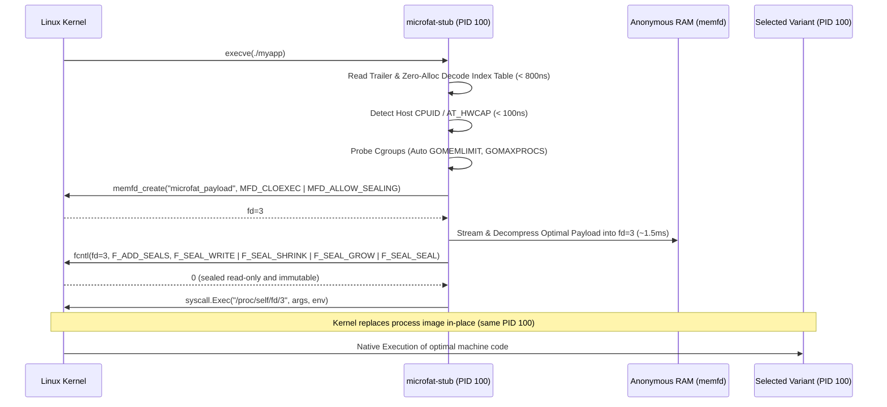

# Microfat Architecture & Format Specification

[**← Main Index**](../README.md#documentation-guide) | [**CLI Reference →**](cli-reference.md)

---

This document provides a technical specification of the **Microfat** binary format, cryptographic trailer structure, Format v2 compact binary index table, shared dictionary mechanics, in-memory execution pipeline, and ARM64/AMD64 hardware detection engine.

---

## 1. Binary Layout Specification

A Microfat fat executable is a composite single-file binary composed of sequential regions:

```
+-------------------------------------------------------------------+
| Region 1: Universal Launcher Stub Binary (ELF x86_64 or aarch64)  |
+-------------------------------------------------------------------+
| Region 2 (Optional): Shared Inter-Variant Dictionary (Zstd)       |
+-------------------------------------------------------------------+
| Region 3: Compressed Variant Payloads                             |
|   - Variant 1 (e.g., GOAMD64=v1 / GOARM64=v8.0)                   |
|   - Variant 2 (e.g., GOAMD64=v2 / GOARM64=v8.2)                   |
|   - Variant 3 (e.g., GOAMD64=v3 / GOARM64=v9.0)                   |
|   - Variant 4 (e.g., GOAMD64=v4 / GOARM64=v9.2)                   |
+-------------------------------------------------------------------+
| Region 4: Metadata Index Table (Format v2 Binary / Format v1 JSON)|
+-------------------------------------------------------------------+
| Region 5: Fixed 56-Byte Cryptographic Trailer (at EOF)            |
|   - 8 Bytes uint64 LE : Index Offset                              |
|   - 8 Bytes uint64 LE : Index Size                                |
|   - 32 Bytes Raw      : Index SHA-256 Checksum                    |
|   - 8 Bytes Magic     : "\x00\xFA\x7FMICRO"                       |
+-------------------------------------------------------------------+
```

---

## 2. Fixed 56-Byte Cryptographic Trailer

The last 56 bytes of every Microfat fat binary contain fixed-width binary fields in Little Endian encoding:

| Field Name | Type | Size | Description |
| :--- | :--- | :--- | :--- |
| `IndexOffset` | `uint64` (LE) | 8 bytes | Absolute byte offset from start of file where the Metadata Index begins. |
| `IndexSize` | `uint64` (LE) | 8 bytes | Byte length of the Metadata Index payload. |
| `IndexSHA256` | `[32]byte` | 32 bytes | Cryptographic SHA-256 checksum of the uncompressed Index bytes. |
| `Magic` | `[8]byte` | 8 bytes | Fixed magic constant: `\x00\xFA\x7FMICRO`. |

### Trailer Integrity Verification Sequence
1. The launcher seeks to `file_size - 56`.
2. Reads the 56-byte trailer and verifies `Magic == "\x00\xFA\x7FMICRO"`.
3. Validates boundary safety: verifies `IndexOffset + IndexSize == file_size - 56`.
4. Reads the Index bytes from `IndexOffset` for `IndexSize` bytes.
5. Computes `sha256(index_bytes)` and verifies it matches `IndexSHA256`. If mismatched, execution immediately aborts with `ErrIndexCorrupted`.

---

## 3. Format v2: Reflection-Free Compact Binary Index Table

**Format v2** (`IndexMagicV2 = "\x00\xFAM2"`) is the default metadata index format in Microfat. Designed for reflection-free zero-allocation decoding, it reduces index parsing time to **$< 800\text{ ns}$**.

### Binary Header Layout

| Offset | Field Name | Type | Encoding | Description |
| :--- | :--- | :--- | :--- | :--- |
| `0..3` | `IndexMagic` | `[4]byte` | ASCII | Fixed magic signature `\x00\xFAM2`. |
| `4..5` | `FormatVersion` | `uint16` | Little Endian | Version number (`2`). |
| `6..13` | `CreatedUnix` | `uint64` | Little Endian | Unix epoch timestamp of creation. |
| `14..21` | `DictOffset` | `uint64` | Little Endian | Byte offset of shared dictionary (`0` if unused). |
| `22..29` | `DictSize` | `uint64` | Little Endian | Byte length of shared dictionary (`0` if unused). |
| `30..33` | `DictID` | `uint32` | Little Endian | Zstandard dictionary ID. |
| `34` | `DictSHALen` | `uint8` | Byte length | Length $N_{\text{sha}}$ of dictionary SHA-256 string. |
| `35..` | `DictSHA` | `[N]byte` | UTF-8 | Hex-encoded dictionary SHA-256 hash. |
| `+0` | `TargetOSLen` | `uint8` | Byte length | Length $N_{\text{os}}$ of target OS string (e.g. `"linux"`). |
| `+1..` | `TargetOS` | `[N]byte` | UTF-8 | Target operating system. |
| `+0` | `TargetArchLen`| `uint8` | Byte length | Length $N_{\text{arch}}$ of target architecture (e.g. `"amd64"`). |
| `+1..` | `TargetArch` | `[N]byte` | UTF-8 | Target architecture string. |
| `+0..1`| `AppNameLen` | `uint16` | Little Endian | Length $N_{\text{app}}$ of application name. |
| `+2..` | `AppName` | `[N]byte` | UTF-8 | Application name string. |
| `+0..1`| `VariantCount` | `uint16` | Little Endian | Number of embedded variant records ($K$). |

### Per-Variant Record Layout ($K$ records)

| Field Name | Type | Encoding | Description |
| :--- | :--- | :--- | :--- |
| `LevelLen` | `uint8` | Byte length | Length $N_{\text{lvl}}$ of microarchitecture level string. |
| `Level` | `[N]byte` | UTF-8 | Microarchitecture level (e.g. `"v1"`, `"v3"`, `"v8.2"`). |
| `Offset` | `uint64` | Little Endian | Byte offset from file start where compressed payload begins. |
| `CompressedSize` | `uint64` | Little Endian | Compressed payload size in bytes. |
| `UncompressedSize`| `uint64` | Little Endian | Raw uncompressed ELF size in bytes. |
| `SHALen` | `uint8` | Byte length | Length $N_{\text{hash}}$ of uncompressed payload SHA-256 string. |
| `SHA256` | `[N]byte` | UTF-8 | Hex-encoded payload SHA-256 hash. |
| `CompLen` | `uint8` | Byte length | Length $N_{\text{comp}}$ of compression codec string. |
| `Compression` | `[N]byte` | UTF-8 | Codec identifier (e.g. `"zstd"`, `"lz4"`, `"none"`). |

---

## 4. Shared Inter-Variant Dictionary Mechanics (`--dict`)

When packaging multi-variant matrices (e.g. `v1`, `v2`, `v3`, `v4`), embedded binaries share $> 70\%$ of identical Go runtime routines and symbol tables.

1. **Dictionary Generation**: `microfat pack --dict` trains a custom 112 KB Zstandard dictionary across all variant ELF payloads.
2. **Payload Compression**: Variants are compressed using the trained dictionary, boosting compression ratios from ~50% to **~75%**.
3. **Payload Decompression**: At launch time, the launcher reads the dictionary once from `DictOffset` into memory and initializes decompression streams instantly.

---

## 5. Format v1: Legacy JSON Manifest (Reference)

For backward compatibility, Microfat can read and produce Format v1 JSON manifests:

```json
{
  "version": 1,
  "app_name": "myapp",
  "os": "linux",
  "arch": "amd64",
  "created_unix": 1787730000,
  "variants": [
    {
      "level": "v1",
      "offset": 3264672,
      "compressed_size": 2945120,
      "uncompressed_size": 7397639,
      "sha256": "f4e7f675b05979c3d4f82877543d994ebfe45b85a3c26027a07f0fefbb105e19",
      "compression": "zstd"
    },
    {
      "level": "v3",
      "offset": 6209792,
      "compressed_size": 2891240,
      "uncompressed_size": 7389447,
      "sha256": "fda5c10d86f6f90647c20c0258d4e414c243eb03a5e8f4955b0a70183b169542",
      "compression": "zstd"
    },
    {
      "level": "v4",
      "offset": 9101032,
      "compressed_size": 2892110,
      "uncompressed_size": 7389447,
      "sha256": "56b5656ccdd1d2938166b268571897c8cfbc760e5dfbf35fb54c93544d6dafe7",
      "compression": "zstd"
    }
  ]
}
```

---

## 6. In-Memory Execution Pipeline & Kernel Memory Sealing (`memfd_create`)

To provide zero-disk-I/O execution while preserving container PID 1, signal forwarding, and complete immunity against in-memory tampering:



### Memory Sealing Lifecycle & Threat Model

Microfat enforces kernel-level memory descriptor sealing to protect decompressed ELF executables in RAM:

1. **Seal-Permissive Creation**: The anonymous file descriptor is created with `MFD_CLOEXEC | MFD_ALLOW_SEALING`.
2. **Payload Extraction & Digest Verification**: The target variant is streamed and decompressed directly into anonymous RAM while verifying the SHA-256 digest.
3. **Mandatory Kernel Sealing**: Before execution, `fcntl(fd, F_ADD_SEALS, ...)` applies four mandatory seals:
   - `F_SEAL_WRITE`: Prevents any write operations, `mmap` writes, or local `/proc/self/mem` modifications to the binary code in RAM.
   - `F_SEAL_SHRINK` & `F_SEAL_GROW`: Prevents truncating or expanding the memory file bounds.
   - `F_SEAL_SEAL`: Permanently freezes the seal bitmask, preventing any subsequent seal additions or alterations.
4. **Direct Descriptor Execution**: The process image is replaced in-place via `/proc/self/fd/<fd>`.
5. **Sealing Failure Guarantees**: Microfat strictly treats unsealed memory as unsafe. If sealing fails (e.g., `ENOSYS`, `EINVAL`, or `EPERM` due to seccomp filters or kernel restrictions):
   - Under auto-dispatch (`MICROFAT_EXEC_MODE=auto`), the launcher immediately closes the unsealed descriptor and cleanly falls back to the hardened cache execution path.
   - Under explicit memfd mode (`MICROFAT_EXEC_MODE=memfd`), execution halts immediately with `ErrMemfdSealingFailed` without attempting fallback.

---

## 7. Resilient Disk Cache Fallback & TOCTOU Defense

If `memfd_create` or memory sealing is restricted by a locked-down seccomp policy or older kernel:
1. The stub falls back to `$XDG_CACHE_HOME/microfat/<sha256>` (or `~/.cache/microfat/<sha256>`). If `$HOME` is unavailable, it resolves to `/tmp/.microfat-<uid>/<sha256>`.
2. **Private Permission Isolation**: All cache directories and variant binaries are created with strict `0o700` (`rwx------`) permissions, isolating cached binaries per-user on multi-tenant systems.
3. **Atomic Installation**: Missing variants are extracted to a private temporary file (`.exec-*.tmp`), verified, synchronized to disk, and atomically moved via `os.Rename`.
4. **Descriptor-Bound Validation (`O_NOFOLLOW`)**:
   - The launcher opens cached binaries exclusively with `unix.O_RDONLY | unix.O_CLOEXEC | unix.O_NOFOLLOW`.
   - `O_NOFOLLOW` ensures the kernel immediately refuses symlink traversal with `ELOOP`, defeating same-UID symlink hijacking attacks.
   - Size and integrity validation operate directly on the opened file descriptor (`fstat` and `pread`).
5. **TOCTOU Immunity via `/proc/self/fd/<fd>`**:
   - The verified file descriptor is executed directly via `/proc/self/fd/<fd>`.
   - Validation and execution are cryptographically bound to the exact same VFS inode, completely eliminating Time-of-Check to Time-of-Use (TOCTOU) file replacement races.
6. **Zero-Overhead Re-execution**: Subsequent launches directly invoke the cached binary descriptor with **0.0ms decompression overhead**.

---

## 8. ARM64 (aarch64) Microarchitecture Matrix

Microfat supports ARM64 microarchitecture levels aligned with the Go compiler `GOARM64` specification (`v8.0` through `v9.5`):

| Level | Compiler Flag | Key Instruction Set Extensions | Target Cloud Silicon & Hardware |
| :--- | :--- | :--- | :--- |
| `v8.0` | `GOARM64=v8.0` | Baseline FP, ASIMD (NEON), 64-bit general registers | Cortex-A53/A72, AWS Graviton 1, Raspberry Pi 3/4 |
| `v8.1` | `GOARM64=v8.1` | `v8.0` + LSE Atomics (`atomics`), CRC32 (`crc32`) | Early server and mobile silicon |
| `v8.2` | `GOARM64=v8.2` | `v8.1` + Half-precision FP (`fphp`, `asimdhp`) | AWS Graviton 2/3, Apple Silicon M1/M2, Ampere Altra |
| `v8.3` | `GOARM64=v8.3` | `v8.2` + JS float conversion (`jscvt`), `fcma`, `lrcpc` | Apple M1/M2+, Cortex-A76+ |
| `v8.4` | `GOARM64=v8.4` | `v8.3` + Dot Product (`asimddp`), `dcpop` | Apple M1 Max/Pro, Neoverse N2 |
| `v8.5` | `GOARM64=v8.5` | `v8.4` + Data Independent Timing (`dit`), `flagm` | Apple M2/M3, modern server cores |
| `v8.6` | `GOARM64=v8.6` | `v8.5` + Matrix Multiplication (`i8mm`), BFloat16 (`bf16`) | Apple M3/M4 |
| `v8.7` | `GOARM64=v8.7` | `v8.6` + Enhanced WFIT/WFIS acceleration (`wfxt`) | Modern enterprise ARM silicon |
| `v8.8` | `GOARM64=v8.8` | `v8.7` + Memory Operations (`mops`), `nmi`, `hbc` | Next-gen server cores |
| `v8.9` | `GOARM64=v8.9` | `v8.8` + Guarded Control Stack (`gcs`), `the` | Next-gen hardened server silicon |
| `v9.0` | `GOARM64=v9.0` | Scalable Vector Extension (`sve`), SVE BitPerm | AWS Graviton 4, Neoverse V2 |
| `v9.1` | `GOARM64=v9.1` | `v9.0` + SVE2 baseline extensions | Enterprise HPC nodes |
| `v9.2` | `GOARM64=v9.2` | `v9.0` + SVE2 + `i8mm` + `bf16` | AI & HPC cloud instances |
| `v9.3`–`v9.5` | `GOARM64=v9.3..9.5` | Scalable Matrix Extension (`sme`, `sme2`) | Next-generation server processors |

### Architectural Layering: Compiler Semantics vs Runtime Probing vs ISA

Microfat strictly separates three concepts:
1. **Go Toolchain Semantics (`GOARM64`)**: The compiler emits instruction subsets gated by compile-time flags (`GOARM64=v8.0`..`v9.5`). Build artifacts assume all prerequisite features are available.
2. **Runtime CPU Probing (`auxv` / `CPUID`)**: The launcher stub never assumes compilation targets. It probes the host kernel via Linux Auxiliary Vectors (`AT_HWCAP`, `AT_HWCAP2`) or CPUID registers to dynamically match the highest satisfied tier.
3. **ARM Architecture Reference Manual ISA**: Feature dependencies form a directed acyclic graph (DAG). Missing any intermediate prerequisite safely degrades execution to the highest compatible parent tier.

### Dual-Tier CPU Feature Probing Architecture

1. **AMD64 Microarchitecture (Exclusive CPUID Authority)**:
   - Queries hardware instruction flags directly via unprivileged native CPUID instructions (`golang.org/x/sys/cpu` and native assembly CPUID leaf probing in `cpuid_amd64.s` for `MOVBE`, `F16C`, and `LZCNT`/`ABM`).
   - CPUID acts as the **sole authoritative source of truth**, eliminating false-positive feature flag promotions and runtime `SIGILL` hazards across virtualized or asymmetric multi-core systems. `/proc/cpuinfo` is restricted strictly to non-authoritative model metadata (e.g., detecting Intel Xeon AVX-512 frequency downclocking risks).

2. **ARM64 Microarchitecture (Auxiliary Vectors & Fallback)**:
   - **Primary Layer**: Directly inspects Linux Auxiliary Vectors (`AT_HWCAP` & `AT_HWCAP2` via `golang.org/x/sys/cpu`) or Darwin `sysctl`.
   - **Fallback Layer**: If running in restricted containers, chroots, or QEMU user emulation where auxiliary vectors are stripped, `internal/microarch` automatically falls back to parsing `/proc/cpuinfo` `Features:` token streams.

---

## 9. Launcher Stub Operational Profiles

| Profile | Build Directive | Stub Binary Size | Supported Capabilities | Recommended Use Case |
| :--- | :--- | :--- | :--- | :--- |
| **Standard Full Stub** | `go build ./cmd/microfat-stub` | `~3.2 MB` | Fast binary table decoding, in-RAM memfd, cgroup auto-tuning, full interactive meta-commands (`--microfat:*`). | General cloud services, developer workstations, release binaries. |
| **Minimal Stub** | `go build -tags minimal ./cmd/microfat-stub` | `~1.1 MB` | Fast binary table decoding, in-RAM memfd, cgroup auto-tuning. Meta-commands stripped. | Ultra-lean container base images, microVMs, edge IoT. |

---

[**← Main Index**](../README.md#documentation-guide) | [**CLI Reference →**](cli-reference.md)
