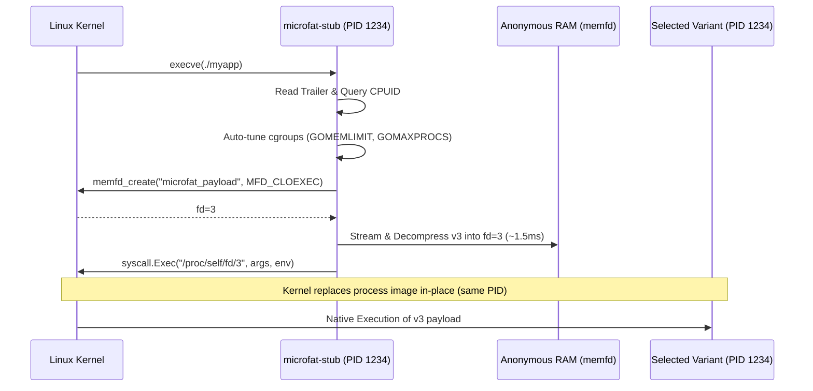

# Microfat Architecture & Format Specification

This document provides a technical specification of the **Microfat** binary format, cryptographic trailer structure, in-memory execution pipeline, and fallback mechanisms.

---

## 1. Binary Layout Specification

A Microfat binary is a composite single-file executable composed of three sequential regions:

```
+-------------------------------------------------------------------+
| Region 1: Universal Launcher Stub (ELF x86_64 or aarch64 Baseline)|
+-------------------------------------------------------------------+
| Region 2: Compressed Variant Payloads                             |
|   - Variant 1 (Zstandard Frame: e.g., GOAMD64=v1 / GOARM64=v8.0)  |
|   - Variant 2 (Zstandard Frame: e.g., GOAMD64=v2 / GOARM64=v8.2)  |
|   - Variant 3 (Zstandard Frame: e.g., GOAMD64=v3 / GOARM64=v9.0)  |
|   - Variant 4 (Zstandard Frame: e.g., GOAMD64=v4 / GOARM64=v9.2)  |
+-------------------------------------------------------------------+
| Region 3: Metadata & Cryptographic Trailer                        |
|   - UTF-8 JSON Index Manifest                                     |
|   - Fixed 56-Byte Cryptographic Trailer (at EOF)                  |
+-------------------------------------------------------------------+
```

---

## 2. Fixed 56-Byte Cryptographic Trailer

The last 56 bytes of every Microfat binary contain fixed-width binary fields in Little Endian encoding:

| Field Name | Type | Size | Description |
| :--- | :--- | :--- | :--- |
| `IndexOffset` | `uint64` (LE) | 8 bytes | Byte offset from file start where the JSON Index begins |
| `IndexSize` | `uint64` (LE) | 8 bytes | Length of the JSON Index payload in bytes |
| `IndexSHA256` | `[32]byte` | 32 bytes | SHA-256 cryptographic hash of the uncompressed JSON Index |
| `Magic` | `[8]byte` | 8 bytes | Fixed magic constant: `\x00\xFA\x7FMICRO` |

### Trailer Integrity Verification Sequence
1. The launcher seeks to `file_size - 56`.
2. Reads the 56-byte trailer and verifies `Magic == "\x00\xFA\x7FMICRO"`.
3. Validates boundary safety: ensures `IndexOffset + IndexSize == file_size - 56`.
4. Reads the JSON Index bytes and computes `sha256(index_bytes)`.
5. Verifies computed SHA-256 matches `IndexSHA256`. If mismatched, execution aborts immediately with a tamper alert.

---

## 3. JSON Index Schema

The JSON Index describes all embedded binary variants and compression formats:

```json
{
  "version": 1,
  "app_name": "myapp",
  "os": "linux",
  "arch": "amd64",
  "created_unix": 1700000000,
  "variants": [
    {
      "level": "v1",
      "offset": 3264672,
      "compressed_size": 3126312,
      "uncompressed_size": 7397639,
      "sha256": "f4e7f675b05979c3d4f82877543d994ebfe45b85a3c26027a07f0fefbb105e19",
      "compression": "zstd"
    },
    {
      "level": "v3",
      "offset": 6390984,
      "compressed_size": 3125821,
      "uncompressed_size": 7389447,
      "sha256": "fda5c10d86f6f90647c20c0258d4e414c243eb03a5e8f4955b0a70183b169542",
      "compression": "zstd"
    },
    {
      "level": "v4",
      "offset": 9516805,
      "compressed_size": 3125859,
      "uncompressed_size": 7389447,
      "sha256": "56b5656ccdd1d2938166b268571897c8cfbc760e5dfbf35fb54c93544d6dafe7",
      "compression": "zstd"
    }
  ]
}
```

---

## 4. In-Memory Execution Pipeline (`memfd_create`)

To provide instant execution without persistent child wrapper processes or disk writes:



### Why `memfd_create`?
- **Zero Disk Writes**: Completely eliminates disk I/O during execution.
- **Read-Only Rootfs Compatible**: Operates cleanly in hardened Kubernetes containers (`readOnlyRootFilesystem: true`) and scratch/distroless environments.
- **No Wrapper Overhead**: `syscall.Exec` replaces the launcher stub image in kernel space, preserving PID 1 in containers and signal forwarding.
- **Container Auto-Tuning**: Before payload execution, automatically probes cgroups to configure `GOMEMLIMIT` and `GOMAXPROCS`. See [Container Resource Auto-Tuning & GC Guidance](runtime-tuning.md) for full GC pacing and `GOGC` tuning recipes.

---

## 5. Resilient User Cache Fallback & Security Model

If `memfd_create` is blocked by hardened seccomp profiles or older kernels:
1. The stub falls back to `$XDG_CACHE_HOME/microfat/<sha256>` (or `~/.cache/microfat/<sha256>`). If the home directory is unavailable, it falls back to `/tmp/.microfat-<uid>/<sha256>`.
2. **Private Permission Isolation**: All cache directories and materialized binary files are created with strict `0o700` (`rwx------`) permissions, isolating cached binaries per-user and preventing exposure on multi-tenant or shared hosts.
3. Extracts the decompressed variant once to a temporary file in the cache directory, verifies its SHA-256 hash, and atomically moves it to its final hash destination.
4. Subsequent invocations execute the cached payload directly with zero decompression latency.

### Ultra-Constrained Container Environments
If both `memfd_create` and disk cache directories fail (e.g. in a locked-down container with a read-only rootfs, no `/proc`, and no writable `/tmp`), the launcher provides an actionable error detailing all attempted paths and remediation steps:
- Ensure `memfd_create` syscall is permitted by seccomp/AppArmor policies.
- Mount an anonymous `tmpfs` volume at `/tmp` or set `$XDG_CACHE_HOME` to a writable volume.

---

## 6. Runtime Observability & Telemetry

When launching the specialized payload, the launcher stub exposes execution metadata:

### Injected Environment Variables
- `MICROFAT_SELECTED_VARIANT`: The chosen CPU microarchitecture variant (e.g., `v1`, `v3`, `v4`).
- `MICROFAT_EXEC_MODE`: The execution dispatch mechanism utilized (`memfd` or `cache`).

### Diagnostic Logging
- Setting `MICROFAT_DEBUG=1` emits human-readable dispatch details to `stderr`:
  ```
  [microfat:debug] host_arch=amd64 host_level=v3 selected_variant=v3 exec_mode=memfd gomemlimit=3865470566B gomaxprocs=4
  ```
- Setting `MICROFAT_LOG=json` emits structured JSON logs to `stderr` for ingestion by container log collectors:
  ```json
  [microfat] {"host_arch":"amd64","host_level":"v3","selected_variant":"v3","exec_mode":"memfd","gomemlimit":"3865470566B","gomaxprocs":"4"}
  ```

---

## 7. ARM64 (aarch64) Microarchitecture Matrix & Detection

Microfat provides comprehensive support for ARM64 server and edge CPU microarchitecture levels aligned with the Go compiler `GOARM64` specification (`v8.0` through `v9.5`).

### Supported Level Matrix

| Level | Compiler Flag | Core Capabilities & Instruction Extensions | Target Silicon / Cloud Profiles |
| :--- | :--- | :--- | :--- |
| `v8.0` | `GOARM64=v8.0` | Baseline FP, ASIMD (NEON), 64-bit general registers | Cortex-A53/A72, AWS Graviton 1, Raspberry Pi 3/4 |
| `v8.1` | `GOARM64=v8.1` | `v8.0` + LSE Atomics (`atomics`), CRC32 (`crc32`) | Early server and mobile silicon |
| `v8.2` | `GOARM64=v8.2` | `v8.1` + Half-precision FP (`fphp`, `asimdhp`) | AWS Graviton 2/3, Apple Silicon M1/M2, Ampere Altra |
| `v8.3` | `GOARM64=v8.3` | `v8.2` + JS float conversion (`jscvt`), `fcma`, `lrcpc` | Apple M1/M2+, Cortex-A76+ |
| `v8.4` | `GOARM64=v8.4` | `v8.3` + Dot Product (`asimddp`), `dcpop` | Apple M1 Max/Pro, Neoverse N2 |
| `v8.5` | `GOARM64=v8.5` | `v8.4` + Data Independent Timing (`dit`), `flagm` | Apple M2/M3, modern server cores |
| `v8.6` | `GOARM64=v8.6` | `v8.5` + Matrix Multiplication (`i8mm`), BFloat16 (`bf16`) | Apple M3/M4 |
| `v8.7` | `GOARM64=v8.7` | `v8.6` + Enhanced WFIT/WFIS acceleration | Latest enterprise ARM silicon |
| `v9.0` | `GOARM64=v9.0` | Scalable Vector Extension (`sve`), SVE BitPerm | AWS Graviton 4, Neoverse V2 |
| `v9.1` | `GOARM64=v9.1` | `v9.0` + SVE2 baseline extensions | Enterprise HPC nodes |
| `v9.2` | `GOARM64=v9.2` | `v9.0` + SVE2 + `i8mm` + `bf16` | AI & HPC cloud instances |
| `v9.3`–`v9.5` | `GOARM64=v9.3..9.5` | Scalable Matrix Extension (`sme`, `sme2`) | Next-generation server processors |

### Dual-Layer CPU Feature Probing
1. **Primary Layer**: Directly inspects Linux Auxiliary Vector (`AT_HWCAP` & `AT_HWCAP2` via `golang.org/x/sys/cpu`) or Darwin `sysctl`.
2. **Fallback Layer**: If running in restricted containers, chroots, or QEMU user emulation where auxiliary vectors are stripped, `internal/microarch` automatically falls back to parsing `/proc/cpuinfo` `Features:` and `flags:` token streams.

