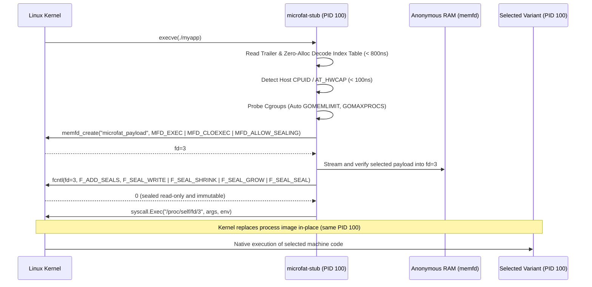

# Microfat Architecture & Format Specification

[**← Main Index**](../README.md#documentation-guide) | [**CLI Reference →**](cli-reference.md)

---

This document provides a technical specification of the **Microfat** binary format, fixed 56-byte trailer structure, Format v2 compact binary index table, shared dictionary mechanics, in-memory execution pipeline, and ARM64/AMD64 hardware detection engine.

---

## 1. Binary Layout Specification

A Microfat fat executable is a composite single-file binary composed of sequential regions:

```
+-------------------------------------------------------------------+
| Region 1: Universal Launcher Stub Binary (ELF x86_64 or aarch64)  |
+-------------------------------------------------------------------+
| Region 2 (Optional): Shared Inter-Variant Dictionary (Zstd)       |
+-------------------------------------------------------------------+
| Region 3: Compressed Variant Payloads                             |
|   - Variant 1 (e.g., GOAMD64=v1 / GOARM64=v8.0)                   |
|   - Variant 2 (e.g., GOAMD64=v2 / GOARM64=v8.2)                   |
|   - Variant 3 (e.g., GOAMD64=v3 / GOARM64=v9.0)                   |
|   - Variant 4 (e.g., GOAMD64=v4 / GOARM64=v9.2)                   |
+-------------------------------------------------------------------+
| Region 4: Metadata Index Table (Format v2 Binary / Format v1 JSON)|
+-------------------------------------------------------------------+
| Region 5: Fixed 56-Byte Trailer & Payload Integrity (at EOF)      |
|   - 8 Bytes uint64 LE : Index Offset                              |
|   - 8 Bytes uint64 LE : Index Size                                |
|   - 32 Bytes Raw      : Index SHA-256 Checksum                    |
|   - 8 Bytes Magic     : "\x00\xFA\x7FMICRO"                       |
+-------------------------------------------------------------------+
```

---

## 2. Fixed 56-Byte Trailer & Payload Integrity

The last 56 bytes of every Microfat fat binary contain fixed-width binary fields in Little Endian encoding:

| Field Name | Type | Size | Description |
| :--- | :--- | :--- | :--- |
| `IndexOffset` | `uint64` (LE) | 8 bytes | Absolute byte offset from start of file where the Metadata Index begins. |
| `IndexSize` | `uint64` (LE) | 8 bytes | Byte length of the Metadata Index payload. |
| `IndexSHA256` | `[32]byte` | 32 bytes | SHA-256 checksum of the uncompressed Index bytes. |
| `Magic` | `[8]byte` | 8 bytes | Fixed magic constant: `\x00\xFA\x7FMICRO`. |

### Trailer Integrity Verification Sequence
1. The launcher seeks to `file_size - 56`.
2. Reads the 56-byte trailer and verifies `Magic == "\x00\xFA\x7FMICRO"`.
3. Validates boundary safety: verifies `IndexOffset + IndexSize == file_size - 56`.
4. Reads the Index bytes from `IndexOffset` for `IndexSize` bytes.
5. Computes `sha256(index_bytes)` and verifies it matches `IndexSHA256`. If mismatched, execution immediately aborts with `ErrIndexCorrupted`.

> [!NOTE]
> **Integrity vs Authenticity**: The 56-byte trailer and metadata index record SHA-256 digests to guarantee payload integrity against storage corruption, network bit-flips, and partial binary modification. They do not provide digital signatures or publisher authenticity against an adversary who rewrites the entire executable. For end-to-end supply-chain provenance, sign the resulting fat binary with Sigstore Cosign or GPG.

See the [threat model and enforcement map](../SECURITY.md#8-threat-model-and-enforcement-map)
for trusted actors, parser/resource bounds and the regression tests behind each runtime boundary.

---

## 3. Format v2: Reflection-Free Compact Binary Index Table

**Format v2** (`IndexMagicV2 = "\x00\xFAM2"`) is the default metadata index format in Microfat. It uses a compact binary table instead of the legacy JSON schema. Measure index parsing separately from process cold-start latency; parser microbenchmarks do not establish end-to-end launch cost.

### Binary Header Layout

| Offset | Field Name | Type | Encoding | Description |
| :--- | :--- | :--- | :--- | :--- |
| `0..3` | `IndexMagic` | `[4]byte` | ASCII | Fixed magic signature `\x00\xFAM2`. |
| `4..5` | `FormatVersion` | `uint16` | Little Endian | Version number (`2`). |
| `6..13` | `CreatedUnix` | `uint64` | Little Endian | Unix epoch timestamp of creation. |
| `14..21` | `DictOffset` | `uint64` | Little Endian | Byte offset of shared dictionary (`0` if unused). |
| `22..29` | `DictSize` | `uint64` | Little Endian | Byte length of shared dictionary (`0` if unused). |
| `30..33` | `DictID` | `uint32` | Little Endian | Zstandard dictionary ID. |
| `34` | `DictSHALen` | `uint8` | Byte length | Length $N_{\text{sha}}$ of dictionary SHA-256 string. |
| `35..` | `DictSHA` | `[N]byte` | UTF-8 | Hex-encoded dictionary SHA-256 hash. |
| `+0` | `TargetOSLen` | `uint8` | Byte length | Length $N_{\text{os}}$ of target OS string (e.g. `"linux"`). |
| `+1..` | `TargetOS` | `[N]byte` | UTF-8 | Target operating system. |
| `+0` | `TargetArchLen`| `uint8` | Byte length | Length $N_{\text{arch}}$ of target architecture (e.g. `"amd64"`). |
| `+1..` | `TargetArch` | `[N]byte` | UTF-8 | Target architecture string. |
| `+0..1`| `AppNameLen` | `uint16` | Little Endian | Length $N_{\text{app}}$ of application name. |
| `+2..` | `AppName` | `[N]byte` | UTF-8 | Application name string. |
| `+0..1`| `VariantCount` | `uint16` | Little Endian | Number of embedded variant records ($K$). |

### Per-Variant Record Layout ($K$ records)

| Field Name | Type | Encoding | Description |
| :--- | :--- | :--- | :--- |
| `LevelLen` | `uint8` | Byte length | Length $N_{\text{lvl}}$ of microarchitecture level string. |
| `Level` | `[N]byte` | UTF-8 | Microarchitecture level (e.g. `"v1"`, `"v3"`, `"v8.2"`). |
| `Offset` | `uint64` | Little Endian | Byte offset from file start where compressed payload begins. |
| `CompressedSize` | `uint64` | Little Endian | Compressed payload size in bytes. |
| `UncompressedSize`| `uint64` | Little Endian | Raw uncompressed ELF size in bytes. |
| `SHALen` | `uint8` | Byte length | Length $N_{\text{hash}}$ of uncompressed payload SHA-256 string. |
| `SHA256` | `[N]byte` | UTF-8 | Hex-encoded payload SHA-256 hash. |
| `CompLen` | `uint8` | Byte length | Length $N_{\text{comp}}$ of compression codec string. |
| `Compression` | `[N]byte` | UTF-8 | Codec identifier (e.g. `"zstd"`, `"lz4"`, `"none"`). |

---

## 4. Shared Inter-Variant Dictionary Mechanics (`--dict`)

When packaging multi-variant matrices (e.g. `v1`, `v2`, `v3`, `v4`), embedded binaries can share runtime routines and symbol tables; the fraction depends on the program and toolchain.

1. **Dictionary Generation**: `microfat pack --dict` trains a custom 112 KB Zstandard dictionary across all variant ELF payloads.
2. **Payload Compression**: Variants are compressed using the trained dictionary, which may reduce size when the variants share suitable byte sequences. Measure the dictionary benefit and extraction cost.
3. **Payload Decompression**: At launch time, the launcher reads the dictionary once from `DictOffset` into memory and initializes bounded decompression streams.

---

## 5. Format v1: Legacy JSON Manifest (Reference)

For backward compatibility, Microfat can read and produce Format v1 JSON manifests:

```json
{
  "version": 1,
  "app_name": "myapp",
  "os": "linux",
  "arch": "amd64",
  "created_unix": 1787730000,
  "variants": [
    {
      "level": "v1",
      "offset": 3264672,
      "compressed_size": 2945120,
      "uncompressed_size": 7397639,
      "sha256": "f4e7f675b05979c3d4f82877543d994ebfe45b85a3c26027a07f0fefbb105e19",
      "compression": "zstd"
    },
    {
      "level": "v3",
      "offset": 6209792,
      "compressed_size": 2891240,
      "uncompressed_size": 7389447,
      "sha256": "fda5c10d86f6f90647c20c0258d4e414c243eb03a5e8f4955b0a70183b169542",
      "compression": "zstd"
    },
    {
      "level": "v4",
      "offset": 9101032,
      "compressed_size": 2892110,
      "uncompressed_size": 7389447,
      "sha256": "56b5656ccdd1d2938166b268571897c8cfbc760e5dfbf35fb54c93544d6dafe7",
      "compression": "zstd"
    }
  ]
}
```

---

## 6. In-Memory Execution Pipeline & Kernel Memory Sealing (`memfd_create`)

Explicit `MICROFAT_EXEC_MODE=memfd`, a cold auto lookup, or fallback from a verified warm cache
that cannot execute uses this pipeline. It preserves process identity and signal behavior:


```mermaid
sequenceDiagram
    participant OS as Linux Kernel
    participant Stub as microfat-stub (PID 100)
    participant RAM as Anonymous RAM (memfd)
    participant App as Selected Variant (PID 100)

    OS->>Stub: execve(./myapp)
    Stub->>Stub: Read Trailer & Zero-Alloc Decode Index Table (< 800ns)
    Stub->>Stub: Detect Host CPUID / AT_HWCAP (< 100ns)
    Stub->>Stub: Probe Cgroups (Auto GOMEMLIMIT, GOMAXPROCS)
    Stub->>OS: memfd_create("microfat_payload", MFD_EXEC | MFD_CLOEXEC | MFD_ALLOW_SEALING)
    OS-->>Stub: fd=3
    Stub->>RAM: Stream and verify selected payload into fd=3
    Stub->>OS: fcntl(fd=3, F_ADD_SEALS, F_SEAL_WRITE | F_SEAL_SHRINK | F_SEAL_GROW | F_SEAL_SEAL)
    OS-->>Stub: 0 (sealed read-only and immutable)
    Stub->>OS: syscall.Exec("/proc/self/fd/3", args, env)
    Note over OS,App: Kernel replaces process image in-place (same PID 100)
    OS->>App: Native execution of selected machine code
```

### Memory Sealing Lifecycle & Threat Model

Microfat enforces kernel-level memory descriptor sealing to protect decompressed ELF executables in RAM:

1. **Seal-Permissive Creation**: The anonymous file descriptor is created with `MFD_EXEC | MFD_CLOEXEC | MFD_ALLOW_SEALING`. Only `EINVAL` permits a retry without `MFD_EXEC` for older kernels; policy denial is not bypassed.
2. **Payload Extraction & Digest Verification**: The target variant is streamed and decompressed directly into anonymous RAM while verifying the SHA-256 digest.
3. **Mandatory Kernel Sealing**: Before execution, `fcntl(fd, F_ADD_SEALS, ...)` applies four mandatory seals:
   - `F_SEAL_WRITE`: Prevents writes and writable shared mappings to the backing file; it does not provide general process-memory isolation.
   - `F_SEAL_SHRINK` & `F_SEAL_GROW`: Prevents truncating or expanding the memory file bounds.
   - `F_SEAL_SEAL`: Permanently freezes the seal bitmask, preventing any subsequent seal additions or alterations.
4. **Direct Descriptor Execution**: The process image is replaced in-place via `/proc/self/fd/<fd>`.
5. **Sealing Failure Guarantees**: Microfat strictly treats unsealed memory as unsafe. If sealing fails (e.g., `ENOSYS`, `EINVAL`, or `EPERM` due to seccomp filters or kernel restrictions):
   - Under auto-dispatch (`MICROFAT_EXEC_MODE=auto`) after a cache miss, the launcher closes the unsealed descriptor and can materialize a verified cache entry. If memfd was attempted after a warm-cache execution failure, it reports both failures without retrying cache.
   - Under explicit memfd mode (`MICROFAT_EXEC_MODE=memfd`), execution halts immediately with `ErrMemfdSealingFailed` without attempting fallback.

---

## 7. Cache-First Auto Dispatch & Descriptor-Bound Execution

Unset `MICROFAT_EXEC_MODE` and explicit `auto` use the same policy in full and minimal launchers:

| Existing cache result | Next action | Filesystem effects |
| :--- | :--- | :--- |
| Valid selected entry | Execute its verified descriptor without source extraction | Read-only lookup and verification |
| Directory absent/unavailable, entry absent, or safe regular entry cannot open | Extract, verify, seal and execute memfd | Lookup leaves paths untouched |
| Corrupt safe regular entry | Extract, verify, seal and execute memfd | Corrupt entry remains untouched |
| Symlink, special file, foreign owner or unsafe entry mode | Reject dispatch | No repair, deletion or fallback |
| Entry metadata cannot be inspected after a non-ENOENT open failure | Reject dispatch | No repair, deletion or fallback |
| Verified entry cannot execute | Try sealed memfd once | No cache rewrite or retry |

On a miss, memfd creation, sealing or execution failure permits the existing verified disk
materialization path. That path can create the cache or replace a corrupt safe regular entry.
After a warm entry fails execution, a memfd failure returns both attempts in order (cache, then
memfd), without another cache attempt. Payload/dictionary corruption or decompression errors found
during extraction are terminal under all modes.

Explicit `memfd` skips cache discovery and requires creation, verification, sealing and execution
to succeed. Explicit `cache` skips memfd and materializes/repairs only safe regular cache entries.
`MICROFAT_VERIFY_CACHE` is ignored: it cannot disable any cache validation.

### Cache validation and materialization

1. **Read-only discovery**: Auto first opens existing cache directories, using
   `$MICROFAT_CACHE_DIR` when supplied, otherwise the XDG/home and temporary-directory candidates
   (`$XDG_CACHE_HOME/microfat`, `~/.cache/microfat`, `/tmp/.microfat-<uid>`). It does not create
   directories, repair permissions, extract payloads or remove entries during lookup.
2. **Private permission boundary**: Existing directories must have the expected owner and no
   group/other write permission. Materialized directories and variant binaries use `0o700`.
   Entries must be regular files owned by the effective UID, without group/other write or special
   permission bits.
3. **Descriptor-bound verification**: Opens use
   `O_RDONLY | O_CLOEXEC | O_NOFOLLOW | O_NONBLOCK` relative to the validated directory descriptor.
   `O_NOFOLLOW` rejects a symlink in the final entry component; `O_NONBLOCK` prevents FIFO waits.
   Every hit checks the exact descriptor's size, owner, mode and SHA-256 against the selected index
   entry. No environment setting weakens those checks. If an open fails before a descriptor exists,
   no-follow metadata inspection can only add a refusal reason; uninspectable entry metadata fails
   closed. Pathname metadata never authorizes execution.
4. **Descriptor-bound execution**: `/proc/self/fd/<fd>` executes the verified inode. Pathname
   replacement cannot redirect that descriptor to another inode, but trusted same-UID writers can
   still modify its contents. Cache execution does not provide memfd's immutable backing storage.
5. **Atomic materialization when requested**: Explicit cache mode, prewarming or a cold memfd
   fallback extracts to a private `.exec-*.tmp` file, verifies and synchronizes it, then atomically
   installs it. Unsafe entries are rejected rather than repaired.

A warm hit avoids source payload/dictionary decompression and uses the cached executable's digest
as integrity evidence against the validated index. It does not verify unused compressed bytes;
authenticate the complete distribution externally before execution. Cache hashing, launcher work
and normal ELF startup still apply. A successful cold memfd launch leaves no persistent cache,
so use prewarming or explicit cache mode to populate one.

The [startup measurements](cache-first-startup.md) compare full-process cold and warm launches
across formats, stub profiles, codecs and execution modes with identical tuning.

Read-only roots can use a valid executable warm entry or sealed memfd without cache writes.
If neither executes, cold disk fallback requires writable cache storage. See the
[runbook](troubleshooting.md#3-read-only-container-root-filesystems-readonlyrootfilesystem-true),
[security boundary](../SECURITY.md#7-launcher-and-cache-deployment-boundary),
[dispatch fault tests](../cmd/microfat-stub/cache_first_linux_test.go) and
[full/minimal regressions](../tests/e2e/cache_first_test.go).

---

## 8. ARM64 (aarch64) Microarchitecture Matrix

Microfat provides an ARM64 compatibility model based on the Arm Architecture Reference Manual (ARM DDI 0487) ISA specifications and aligned with the Go compiler `GOARM64` level hierarchy (`v8.0` through `v9.5`):

| Level | Compiler Flag | Key Instruction Set Extensions | Target Cloud Silicon & Hardware |
| :--- | :--- | :--- | :--- |
| `v8.0` | `GOARM64=v8.0` | Baseline FP, ASIMD (NEON), 64-bit general registers | Cortex-A53/A72, AWS Graviton 1, Raspberry Pi 3/4 |
| `v8.1` | `GOARM64=v8.1` | `v8.0` + LSE Atomics (`atomics`), CRC32 (`crc32`) | Early server and mobile silicon |
| `v8.2` | `GOARM64=v8.2` | `v8.1` + Half-precision FP (`fphp`, `asimdhp`) | AWS Graviton 2/3, Apple Silicon M1/M2, Ampere Altra |
| `v8.3` | `GOARM64=v8.3` | `v8.2` + JS float conversion (`jscvt`), `fcma`, `lrcpc` | Apple M1/M2+, Cortex-A76+ |
| `v8.4` | `GOARM64=v8.4` | `v8.3` + Dot Product (`asimddp`), `dcpop` | Apple M1 Max/Pro, Neoverse N2 |
| `v8.5` | `GOARM64=v8.5` | `v8.4` + Data Independent Timing (`dit`), `flagm` | Apple M2/M3, modern server cores |
| `v8.6` | `GOARM64=v8.6` | `v8.5` + Matrix Multiplication (`i8mm`), BFloat16 (`bf16`) | Apple M3/M4 |
| `v8.7` | `GOARM64=v8.7` | `v8.6` + Enhanced WFIT/WFIS acceleration (`wfxt`) | Modern enterprise ARM silicon |
| `v8.8` | `GOARM64=v8.8` | `v8.7` + Memory Operations (`mops`), `nmi`, `hbc` | Next-gen server cores |
| `v8.9` | `GOARM64=v8.9` | `v8.8` + Guarded Control Stack (`gcs`), `the` | Next-gen hardened server silicon |
| `v9.0` | `GOARM64=v9.0` | Scalable Vector Extension (`sve`), SVE BitPerm | AWS Graviton 4, Neoverse V2 |
| `v9.1` | `GOARM64=v9.1` | `v9.0` + SVE2 baseline extensions | Enterprise HPC nodes |
| `v9.2` | `GOARM64=v9.2` | `v9.0` + SVE2 + `i8mm` + `bf16` | AI & HPC cloud instances |
| `v9.3`–`v9.5` | `GOARM64=v9.3..9.5` | Scalable Matrix Extension (`sme`, `sme2`) | Next-generation server processors |

### Architectural Layering: Compiler Semantics vs Runtime Probing vs ISA

Microfat strictly distinguishes between three complementary layers:
1. **Go Toolchain Target Levels (`GOARM64`)**: The Go toolchain (`src/internal/buildcfg/cfg.go`) defines accepted compilation targets (`GOARM64=v8.0`..`v9.5`). The compiler emits instruction subsets gated by compile-time flags (e.g., mandatory LSE atomics starting at `v8.1`).
2. **Microfat ARM ISA Compatibility Model**: Microfat defines a granular, forward-compatible hardware capability contract derived from Arm Architecture Reference Manual Armv8-A / Armv9-A specifications for each milestone (including `v8.8` MOPS/NMI/HBC and `v8.9` GCS/THE).
3. **Runtime CPU Probing (`auxv` / `AT_HWCAP`)**: The launcher stub never assumes compilation targets. It probes the host kernel via Linux Auxiliary Vectors (`AT_HWCAP`, `AT_HWCAP2`) or Darwin `sysctl` to dynamically match the highest satisfied tier, safely degrading execution if any prerequisite is missing.

### Dual-Tier CPU Feature Probing Architecture

1. **AMD64 Microarchitecture (Exclusive CPUID Authority)**:
   - Queries hardware instruction flags directly via unprivileged native CPUID instructions (`golang.org/x/sys/cpu` and native assembly CPUID leaf probing in `cpuid_amd64.s` for `MOVBE`, `F16C`, and `LZCNT`/`ABM`).
   - CPUID acts as the **sole authoritative source of truth**, eliminating false-positive feature flag promotions and runtime `SIGILL` hazards across virtualized or asymmetric multi-core systems. `/proc/cpuinfo` is restricted strictly to non-authoritative model metadata (e.g., detecting Intel Xeon AVX-512 frequency downclocking risks).

2. **ARM64 Microarchitecture (Auxiliary Vectors & Fallback)**:
   - **Primary Layer**: Directly inspects Linux Auxiliary Vectors (`AT_HWCAP` & `AT_HWCAP2` via `golang.org/x/sys/cpu`) or Darwin `sysctl`.
   - **Fallback Layer**: If running in restricted containers, chroots, or QEMU user emulation where auxiliary vectors are stripped, `internal/microarch` automatically falls back to parsing `/proc/cpuinfo` `Features:` token streams.

---

## 9. Launcher Stub Operational Profiles

| Profile | Build Directive | Stub Binary Size | Supported Capabilities | Recommended Use Case |
| :--- | :--- | :--- | :--- | :--- |
| **Standard Full Stub** | `go build ./cmd/microfat-stub` | `~3.2 MB` | Fast binary table decoding, cache-first auto/sealed memfd dispatch, cgroup auto-tuning, full interactive meta-commands (`--microfat:*`). | General cloud services, developer workstations, release binaries. |
| **Minimal Stub** | `go build -tags minimal ./cmd/microfat-stub` | `~1.1 MB` | Fast binary table decoding, cache-first auto/sealed memfd dispatch, cgroup auto-tuning. Meta-commands stripped. | Ultra-lean container base images, microVMs, edge IoT. |

---

[**← Main Index**](../README.md#documentation-guide) | [**CLI Reference →**](cli-reference.md)
