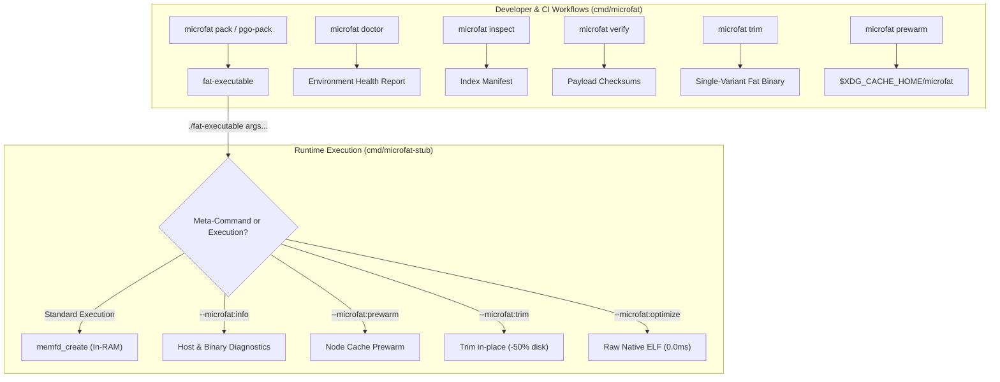

# Microfat CLI & Launcher Stub Reference

[**← Architecture Specification**](architecture.md) | [**Main Index**](../README.md#documentation-guide) | [**Container Runtime Tuning →**](runtime-tuning.md)

---

This document provides an exhaustive reference for the `microfat` developer and CI CLI toolkit, as well as the runtime launcher stub (`microfat-stub`) meta-commands, flags, exit codes, and environment variable controls.

---

## 1. Overview & Tooling Architecture

`microfat` distributes two main command-line interfaces:

1. **`microfat`**: The primary developer CLI used during build, packaging, inspection, validation, container preparation, and environment testing.
2. **`microfat-stub`**: The lightweight launcher binary prefixed to packaged fat executables. It intercepts execution at launch time, auto-detects host microarchitecture, configures Linux container resource limits, and handles reserved meta-commands (`--microfat:*`).



---

## 2. Developer CLI Commands (`microfat`)

### Global Flags

| Flag | Shorthand | Type | Default | Description |
| :--- | :--- | :--- | :--- | :--- |
| `--version` | `-v` | `bool` | `false` | Display version, commit, build date, and vendor metadata. |
| `--help` | `-h` | `bool` | `false` | Show command help and usage instructions. |

---

### `microfat detect`

Detect the local host CPU microarchitecture level, supported vector extensions, and CPU features.

```bash
# Human-readable output
microfat detect

# Machine-readable JSON output
microfat detect --json
```

#### Flags
| Flag | Shorthand | Type | Default | Description |
| :--- | :--- | :--- | :--- | :--- |
| `--json` | *(none)* | `bool` | `false` | Output results in formatted JSON. |

#### Example JSON Output:
```json
{
  "os": "linux",
  "arch": "amd64",
  "level": "v3",
  "features": [
    "cx16",
    "popcnt",
    "sse3",
    "ssse3",
    "sse4.1",
    "sse4.2",
    "avx",
    "avx2",
    "bmi1",
    "bmi2",
    "fma",
    "osxsave"
  ]
}
```

---

### `microfat doctor`

Verify the local host runtime environment readiness for high-performance Microfat dispatch, checking CPU capabilities, in-memory execution (`memfd_create`), disk cache fallback permissions, and Linux container cgroup limits.

```bash
# Standard environment inspection
microfat doctor

# Machine-readable JSON output (recommended for CI/CD gates)
microfat doctor --json

# Strict mode (fails if memfd_create is unavailable)
microfat doctor --strict

# Custom cache directory audit
microfat doctor --cache-dir /var/cache/microfat
```

#### Flags
| Flag | Shorthand | Type | Default | Description |
| :--- | :--- | :--- | :--- | :--- |
| `--json` | *(none)* | `bool` | `false` | Output complete diagnostic report in JSON. |
| `--cache-dir` | *(none)* | `string` | *(unset)* | Custom disk cache directory path to probe and verify. |
| `--strict` | *(none)* | `bool` | `false` | Require both `memfd_create` and disk cache to be functional; fail if either is blocked. |

#### Human-Readable Output:
```text
=== Microfat Host Environment Doctor ===

[✔] Host CPU Microarchitecture
    • OS/Arch:        linux/amd64
    • Detected Level: v3
    • Key Features:   cx16, popcnt, sse3, ssse3, sse4.1, sse4.2, avx, avx2, bmi1, bmi2, fma, osxsave
    • AVX-512 Status: not present (no downclock risk)

[✔] In-Memory Execution (memfd_create)
    • Kernel Support: Available (Linux 6.8.0-generic)
    • Seccomp Filter: Permitted

[✔] Disk Cache Execution Fallback
    • Resolved Path:  /home/deployer/.cache/microfat
    • Permissions:    0700 (read/write OK)

[✔] Container Resource Limits (cgroup v2)
    • Memory Limit:   2147483648 B (2.00 GiB)
    • CFS CPU Quota:  4.00 cores
    • Auto GOMEMLIMIT: 1932735283 B (~1.80 GiB)
    • Auto GOMAXPROCS: 4

[✔] Toolchain & Version Metadata
    • Version:        1.4.0
    • Commit:         7a8b9c0
    • Build Date:     2026-08-28T02:00:00Z

Summary: Environment is fully ready for high-performance Microfat dispatch!
```

---

### `microfat inspect <binary>`

Inspect embedded variants, format version, dictionary metadata, uncompressed/compressed sizes, and platform targeting inside an existing fat binary.

```bash
# Standard table inspection
microfat inspect bin/myapp

# JSON inspection
microfat inspect bin/myapp --json
```

#### Flags
| Flag | Shorthand | Type | Default | Description |
| :--- | :--- | :--- | :--- | :--- |
| `--json` | *(none)* | `bool` | `false` | Output binary index manifest in JSON. |

#### Example Output:
```text
Binary Path:       bin/myapp
App Name:          myapp
Format Version:    v2 (compact binary table)
Target Platform:   linux/amd64
Total Size:        12582912 bytes
Shared Dictionary: 114688 bytes (offset 3254120, sha256: 8f3c4e1b...)
Created At:        2026-08-28T02:30:00Z

Embedded Variants (3 total):
  • v1     [zstd] offset:    3368808 | comp:    2945120 B | raw:    7397639 B (39.8%) | sha256: f4e7f675b059...
  • v3     [zstd] offset:    6313928 | comp:    2891240 B | raw:    7389447 B (39.1%) | sha256: fda5c10d86f6...
  • v4     [zstd] offset:    9205168 | comp:    2892110 B | raw:    7389447 B (39.1%) | sha256: 56b5656ccdd1...
```

---

### `microfat verify <binary>`

Cryptographically validate the 56-byte trailer magic, index SHA-256 hash, and payload integrity checksums of all embedded variants.

```bash
# Verify binary integrity
microfat verify bin/myapp

# JSON output for CI pipeline checks
microfat verify bin/myapp --json
```

#### Flags
| Flag | Shorthand | Type | Default | Description |
| :--- | :--- | :--- | :--- | :--- |
| `--json` | *(none)* | `bool` | `false` | Output verification results in structured JSON format. |

#### Exit Code Behavior:
- `0`: All embedded payloads and trailers matched their cryptographic SHA-256 checksums.
- `1`: One or more variants failed verification or trailer was corrupted.

---

### `microfat pack`

Package multiple pre-compiled microarchitecture-specific ELF binaries into a self-dispatching fat executable.

```bash
# AMD64 manual packaging with balanced compression
microfat pack \
  --stub bin/microfat-stub \
  --name myapp \
  -v v1=dist/app_v1 \
  -v v3=dist/app_v3 \
  -v v4=dist/app_v4 \
  -o bin/myapp

# ARM64 packaging with shared dictionary compression
microfat pack \
  --stub bin/microfat-stub-arm64 \
  --name myapp \
  --arch arm64 \
  --dict \
  -v v8.0=dist/app_arm64_v80 \
  -v v8.2=dist/app_arm64_v82 \
  -v v9.0=dist/app_arm64_v90 \
  -o bin/myapp-arm64

# Declarative build using manifest file
microfat pack --manifest pgo.yaml -o bin/myapp
```

#### Flags
| Flag | Shorthand | Type | Default | Description |
| :--- | :--- | :--- | :--- | :--- |
| `--stub` | *(none)* | `string` | `""` | Path to the `microfat-stub` launcher binary. |
| `--output` | `-o` | `string` | `""` | Destination output path for the packaged fat executable. |
| `--name` | *(none)* | `string` | `""` | Application name string embedded in manifest. |
| `--os` | *(none)* | `string` | `"linux"` | Target operating system. |
| `--arch` | *(none)* | `string` | `"amd64"` | Target architecture (`amd64` or `arm64`). |
| `--variant` | `-v` | `stringArray` | `[]` | Variant mapping in `<level>=<path>` format (e.g. `-v v1=bin/v1 -v v3=bin/v3`). |
| `--profile` | *(none)* | `string` | `""` | Compression profile preset: `latency`, `balanced`, `size`. |
| `--compression` | *(none)* | `string` | `""` | Compression algorithm: `zstd`, `lz4`, `none` (e.g. `zstd:11`). |
| `--compression-level` | *(none)* | `string` | `""` | Compression level override: `fastest`, `default`, `better`, `best`, or number. |
| `--dict`, `--zstd-dict` | *(none)* | `bool` | `false` | Enable shared Zstandard inter-variant dictionary compression. |
| `--dict-size` | *(none)* | `int` | `114688` | Target shared dictionary size in bytes (default: 112 KB). |
| `--format-version` | *(none)* | `int` | `2` | Binary format version: `2` (compact binary table) or `1` (legacy JSON). |
| `--skip-elf-validation` | *(none)* | `bool` | `false` | Skip ELF header architecture and machine type validation. |
| `--manifest` | `-m` | `string` | `""` | Path to YAML or JSON declarative build manifest. |
| `--concurrency` | `-j` | `int` | `NumCPU` | Concurrent compiler workers when building via manifest. |
| `--keep-intermediates` | *(none)* | `bool` | `false` | Retain intermediate compiled variant binaries when building via manifest. |
| `--go-binary` | *(none)* | `string` | `""` | Path to custom Go toolchain binary (defaults to `$GO` or `go`). |

---

### `microfat pgo-pack`

Compile and package multiple microarchitecture variants with Profile-Guided Optimization (`-pgo`) profiles concurrently in a single step using a declarative YAML/JSON manifest.

```bash
microfat pgo-pack --manifest pgo.yaml -o bin/myapp
```

#### Manifest Schema (`pgo.yaml`):
```yaml
name: payment-service
package: ./cmd/payment-service
output: bin/payment-service
stub: bin/microfat-stub
target_os: linux
target_arch: amd64
default_pgo: profiles/baseline.pgo
build_flags:
  - "-trimpath"
  - "-ldflags=-s -w"
variants:
  - level: v1
    pgo: "off"
  - level: v3
    pgo: profiles/v3.pgo
  - level: v4
    pgo: profiles/v4.pgo
```

#### Flags
Accepts all manifest and compiler flags matching `microfat pack` (`--manifest`, `-o`, `--stub`, `--concurrency`, `--profile`, `--compression`, `--dict`, `--keep-intermediates`, `--go-binary`, `--skip-elf-validation`).

---

### `microfat trim <binary>`

Trim unneeded microarchitecture variants from a fat binary, retaining the launcher stub, container auto-tuning, and the chosen optimal level on disk.

```bash
# In-place trimming to host microarchitecture level (-50% disk footprint)
microfat trim bin/myapp

# Trim to explicit target level and output path
microfat trim bin/myapp --level v3 -o bin/myapp-v3

# Trim applying max ceiling and safe downclock policy
microfat trim bin/myapp --max-level v3 --policy safe_avx512 -o bin/myapp-safe
```

#### Flags
| Flag | Shorthand | Type | Default | Description |
| :--- | :--- | :--- | :--- | :--- |
| `--output` | `-o` | `string` | `""` | Destination output path (defaults to in-place replacement). |
| `--level` | *(none)* | `string` | `""` | Target level to retain (defaults to auto-detected host level). |
| `--max-level` | *(none)* | `string` | `""` | Maximum microarchitecture level ceiling to retain. |
| `--disable-variants` | *(none)* | `string` | `""` | Comma-separated list of variant levels to exclude. |
| `--policy` | *(none)* | `string` | `""` | Policy preset name (`safe_avx512`, `no_downclock`). |

---

### `microfat prewarm <binary>`

Pre-extract payload variants into the local node cache (`$XDG_CACHE_HOME/microfat`) to eliminate decompression latency on initial startup.

```bash
# Prewarm host-optimal variant into cache
microfat prewarm bin/myapp

# Prewarm all embedded variants (for multi-tenant cache partitions)
microfat prewarm bin/myapp --all

# Prewarm to custom cache path
microfat prewarm bin/myapp --cache-dir /var/cache/microfat

# Verify cache health without re-extracting
microfat prewarm bin/myapp --verify

# Structured JSON output for initContainers
microfat prewarm bin/myapp --json
```

#### Flags
| Flag | Shorthand | Type | Default | Description |
| :--- | :--- | :--- | :--- | :--- |
| `--level` | `-l` | `string` | `""` | Specific variant level to prewarm (defaults to host-optimal). |
| `--all` | *(none)* | `bool` | `false` | Prewarm all embedded variants into the cache directory. |
| `--cache-dir` | *(none)* | `string` | `""` | Custom cache directory path. |
| `--verify` | *(none)* | `bool` | `false` | Verify existing cache entry integrity without extracting. |
| `--json` | *(none)* | `bool` | `false` | Output results in JSON telemetry format. |

---

## 3. Runtime Launcher Stub Meta-Commands

Every fat binary built with standard `microfat-stub` supports built-in meta-commands:

```bash
# 1. Print runtime diagnostic information
./myapp --microfat:info
./myapp --microfat:info=json

# 2. Prewarm variant into node cache and exit 0
./myapp --microfat:prewarm
./myapp --microfat:prewarm=all
./myapp --microfat:prewarm=verify

# 3. In-place trim unneeded variants on disk
./myapp --microfat:trim
./myapp --microfat:specialize

# 4. Extract single-variant fat binary to a target file
./myapp --microfat:trim-to /usr/local/bin/myapp
./myapp --microfat:specialize-to /usr/local/bin/myapp

# 5. In-place permanently specialize to raw uncompressed native ELF
./myapp --microfat:optimize

# 6. Extract raw uncompressed native ELF to a target file
./myapp --microfat:optimize-to /usr/local/bin/myapp

# 7. Print launcher stub help message
./myapp --microfat:help
```

> [!NOTE]
> **Minimal Stub Profile (`-tags minimal`)**:
> In ultra-lean production deployments where launcher stub size must be minimized to $< 1.2\text{ MB}$, compile the stub with `go build -tags minimal ./cmd/microfat-stub` (or use `bin/microfat-stub-minimal`). The minimal stub retains zero-allocation binary table decoding and in-RAM dispatch, but strips interactive meta-command handlers (`--microfat:*`).

---

## 4. Environment Variables Reference

### Input Configuration & Policy Controls

| Variable | Type | Default | Description |
| :--- | :--- | :--- | :--- |
| `MICROFAT_AUTOTUNE` | `bool` (`1`/`0`, `true`/`false`) | `1` | Enable automatic Linux cgroup v1/v2 limit probing and `GOMEMLIMIT`/`GOMAXPROCS` injection. |
| `MICROFAT_MEM_RATIO` | `float` | `0.90` | Fraction of container cgroup memory ceiling assigned to `GOMEMLIMIT` (e.g. `0.85` or `0.80`). |
| `MICROFAT_GC_PROFILE` | `string` | `default` | Workload GC profile: `latency_critical` (GOGC=75), `memory_constrained` (GOGC=40), `batch_etl` (GOGC=off), `adaptive`. |
| `MICROFAT_LIVE_HEAP_ESTIMATE` | `string` | *(unset)* | Steady-state live heap size string for `adaptive` profile (e.g. `150MB`, `150MiB`, `157286400`). |
| `MICROFAT_FORCE_LEVEL` | `string` | *(unset)* | Strictly pin execution to a specific variant level (`v1`, `v2`, `v3`, `v4`, `v8.0`..`v9.5`). Fails fast if unsupported. |
| `MICROFAT_MAX_LEVEL` | `string` | *(unset)* | Cap selection ceiling to a maximum level (e.g. `v3` or `v8.2`). |
| `MICROFAT_DISABLE_VARIANTS` | `string` | *(unset)* | Comma-separated list of variant levels to exclude from selection (e.g. `v4,v9.2`). |
| `MICROFAT_POLICY` | `string` | *(unset)* | Preset dispatch policy name (`safe_avx512`, `no_downclock`). |
| `MICROFAT_AVX512_DOWNCLOCK_PROTECTION` | `bool` | `0` | Enable Intel Skylake-X/Cascade Lake Xeon downclocking mitigation. |
| `MICROFAT_EXEC_MODE` | `string` | `memfd` | Dispatch mechanism: `memfd` (in-RAM execution) or `cache` (from node cache). |
| `MICROFAT_CACHE_DIR` | `string` | *(unset)* | Custom node cache directory path (defaults to `$XDG_CACHE_HOME/microfat`). |
| `MICROFAT_LOG` | `string` | `text` | Logging mode: `text` or `json` (structured JSON telemetry on stderr). |
| `MICROFAT_DEBUG` | `bool` | `0` | Enable detailed microsecond startup and dispatch logging on stderr. |
| `GOMEMLIMIT` | `string` | *(unset)* | If already set in the environment, Microfat **never** overrides it. |
| `GOMAXPROCS` | `string` | *(unset)* | If already set in the environment, Microfat **never** overrides it. |

---

### Exported Downstream Runtime Telemetry Variables

Whenever the launcher stub executes a payload variant, it exports runtime metadata variables to child processes in `os.Environ()`:

| Environment Variable | Type | Example Value | Description |
| :--- | :--- | :--- | :--- |
| `MICROFAT_SELECTED_VARIANT` | `string` | `v3` | Microarchitecture level selected for execution. |
| `MICROFAT_HOST_ARCH` | `string` | `amd64` | Detected host CPU architecture. |
| `MICROFAT_HOST_LEVEL` | `string` | `v4` | Highest detected microarchitecture capability of host CPU. |
| `MICROFAT_EXEC_MODE` | `string` | `memfd` | Runtime dispatch mechanism (`memfd` or `cache`). |
| `MICROFAT_DISPATCH_MODE` | `string` | `memfd` | Alias for `MICROFAT_EXEC_MODE`. |
| `MICROFAT_POLICY_APPLIED` | `string` | `safe_avx512` | Policy applied during variant selection. |
| `MICROFAT_OVERRIDE_REASON` | `string` | `Intel Skylake-X downclock protection` | Explanatory reason for policy override. |
| `MICROFAT_SELECTED_SHA256` | `string` | `fda5c10d86f6...` | SHA-256 hash of the uncompressed payload. |
| `MICROFAT_SELECTED_SIZE` | `int64` | `7389447` | Uncompressed byte length of selected payload. |
| `MICROFAT_CGROUP_VERSION` | `int` | `2` | Detected cgroup version (`1` or `2`). |
| `MICROFAT_CGROUP_LIMIT_BYTES` | `int64` | `2147483648` | Raw container memory limit in bytes. |
| `MICROFAT_CGROUP_CPUS` | `float64` | `4.00` | Raw container CPU CFS quota. |
| `MICROFAT_CGROUP_GOMEMLIMIT` | `string` | `1932735283B` | Auto-computed `GOMEMLIMIT` ceiling. |
| `MICROFAT_CGROUP_GOMAXPROCS` | `string` | `4` | Auto-computed `GOMAXPROCS` thread count. |
| `MICROFAT_CGROUP_GOGC` | `string` | `75` | Auto-computed `GOGC` pacing target. |
| `MICROFAT_CGROUP_GC_PROFILE` | `string` | `latency_critical` | Active GC workload profile name. |

---

[**← Architecture Specification**](architecture.md) | [**Main Index**](../README.md#documentation-guide) | [**Container Runtime Tuning →**](runtime-tuning.md)
