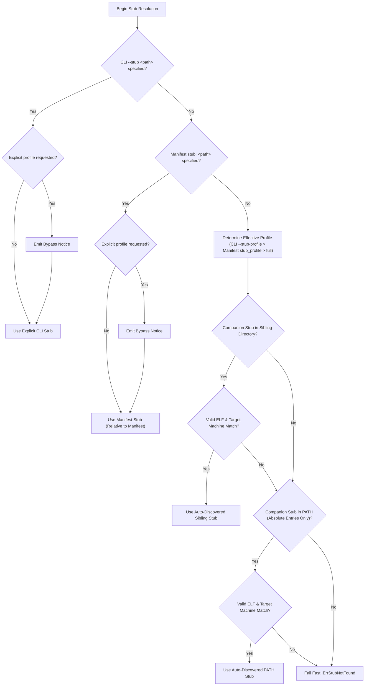
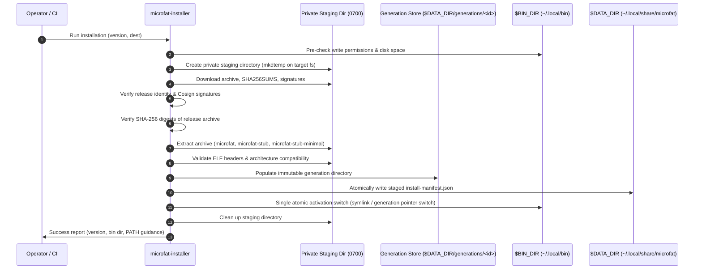

# microfat Installation Transaction, Ownership Metadata & Companion Discovery Contract

**Document Version:** 1.0.0  
**Status:** Approved Architecture Contract  
**Related Issues:** [#40](https://github.com/EpicBlackWolfZ/microfat/issues/40) (Stub Profile Selection), [#203](https://github.com/EpicBlackWolfZ/microfat/issues/203) (Verified Linux Release Installer), [#204](https://github.com/EpicBlackWolfZ/microfat/issues/204) (Atomic Update Transaction), [#205](https://github.com/EpicBlackWolfZ/microfat/issues/205) (Ownership Detection)

---

## 1. Executive Summary & Purpose

The `microfat` toolchain packages microarchitecture-specialized Go ELF binaries (e.g. `amd64_v1`..`v4`, `arm64_v8.0`..`v9.5`) into self-dispatching fat executables. At packaging time, `microfat` prepends a launcher stub to the payload. To support different production requirements, `microfat` ships two companion launcher stubs alongside the CLI:
1. **`microfat-stub` (`full`)**: The standard launcher stub featuring interactive runtime meta-commands (`--microfat:info`, `--microfat:optimize`, `--microfat:trim`, etc.), container resource auto-tuning, and direct in-memory (`memfd_create`) / cache dispatch.
2. **`microfat-stub-minimal` (`minimal`)**: A lightweight launcher stub compiled with `-tags minimal` with interactive introspection and optimization commands stripped for smallest payload overhead in resource-constrained environments.

This document defines the formal, durable contract between:
- **Installer & Distribution (#203)**: How release artifacts are downloaded, cryptographically verified, staged, atomically installed, and tracked without requiring `sudo` or pre-existing dependencies (Go/Cosign).
- **Packaging Engine & Stub Profile Discovery (#40)**: How `microfat pack`, manifest-driven packaging, and `pgo-pack` discover and resolve the appropriate companion launcher stub across native, `memfd_create`, and cached runtime dispatches.
- **Update & Lifecycle Operations (#204, #205)**: How ownership metadata is recorded and inspected so subsequent updates or uninstalls never overwrite or corrupt unmanaged binaries or user workloads.

---

## 2. Directory Layout & File Inventory

### 2.1 Standard Installation Locations

`microfat` strictly adheres to standard Linux XDG Base Directory specifications and standard POSIX conventions:

| Scope | Binary Destination (`$BIN_DIR`) | Metadata & Manifests (`$DATA_DIR`) | Privilege Model |
| :--- | :--- | :--- | :--- |
| **User (Default)** | `$HOME/.local/bin` (or `$XDG_BIN_HOME`) | `$HOME/.local/share/microfat` (or `$XDG_DATA_HOME/microfat`) | Current user; no `sudo` or elevation |
| **System (`--system`)** | `/usr/local/bin` (or custom `--dest`) | `/usr/local/share/microfat` | Requires `sudo` / root capabilities |

### 2.2 Sibling Companion Triad

Release archives (`microfat_<version>_linux_<arch>.tar.gz`) bundle exactly three executable binaries that must be deployed together as a cohesive triad:

```
$BIN_DIR/
├── microfat                 # Universal fat CLI binary (containing specialized CPU variants)
├── microfat-stub            # Standard (full) launcher stub binary
└── microfat-stub-minimal    # Lightweight (minimal) launcher stub binary
```

- **Inviolable Sibling Invariant**: An official installation of `microfat` must deploy `microfat`, `microfat-stub`, and `microfat-stub-minimal` into the exact same `$BIN_DIR` directory.
- **Preserved Binary Bytes Invariant**: Binaries are pre-stripped and finalized during the official build process. Installers and package managers must NEVER execute `strip`, `objcopy`, `install -s`, or any ELF-rewriting tool on `microfat` or either launcher stub. Such utilities truncate the embedded payload table and 56-byte trailer (`\x00\xFA\x7FMICRO`), rendering fat binaries inoperable.

---

## 3. Sibling Companion Stub Discovery Contract

### 3.1 5-Tier Precedence Hierarchy

When packaging fat binaries (`microfat pack` or `microfat pgo-pack`), `microfat` resolves the launcher stub binary according to the following strict, deterministic hierarchy:



1. **Explicit CLI `--stub <path>`**:
   - Takes absolute precedence over automatic profile discovery and manifest declarations.
   - Evaluated relative to the caller's working directory.
   - Must resolve to a regular, readable file. Fails fast with `ErrStubNotFound` if missing or invalid (no silent fallback).
   - When an explicit profile was requested (`--stub-profile` or manifest `stub_profile`), the custom stub path wins unconditionally and `microfat` emits an operational notice:
     `Using explicit launcher stub <quoted path>; automatic stub-profile selection was bypassed. The requested profile is not asserted for this custom path.`
   - Does not warn merely because omission defaults automatic discovery to `full`.
   - When specified, a lower-priority manifest stub path is neither opened nor compared.

2. **Manifest `stub:` field**:
   - Evaluated relative to the manifest directory.
   - Unconditionally overrides automatic companion discovery when CLI `--stub` is omitted.
   - Must resolve to a regular, readable file. Fails fast with `ErrStubNotFound` if missing or invalid.
   - When an explicit profile was requested, emits the operational bypass notice.

3. **Sibling Discovery via `ResolveInstallationDirectory()`**:
   - Evaluates the directory containing the running `microfat` executable.
   - **Native Execution**: Resolved via `/proc/self/exe` (`readlink`) falling back to `os.Executable()`.
   - **Dispatched Execution (memfd / cache)**: When `microfat` runs as a dispatched fat binary, `/proc/self/exe` points to `/memfd:microfat_payload (deleted)` or `$XDG_CACHE_HOME/microfat/...`. In this mode, `ResolveInstallationDirectory()` reads `MICROFAT_ORIGINAL_EXE`, cryptographically validates the running payload's size and SHA-256 checksum against the original executable's embedded index table, and derives the true parent installation directory.
   - Looks for `microfat-stub` when profile is `full`, or `microfat-stub-minimal` when profile is `minimal`.

4. **PATH Discovery (Absolute Directories Only)**:
   - If sibling discovery does not find the target companion stub, `microfat` inspects `$PATH`.
   - **Security Restriction**: Only absolute directory entries in `$PATH` are evaluated. Empty entries, current directory (`.`), relative paths, and unauthorized locations are strictly ignored to prevent binary injection.
   - Candidate files must have executable permissions (`0111`).

5. **Explanatory Failure**:
   - If no valid companion stub is located, `microfat` halts with an explicit error detailing the missing stub, the selected profile, and actionable remediation steps.

### 3.2 Non-Executing Candidate Inspection

To prevent executing untrusted, foreign, or malicious binaries during discovery:
- Candidate files are opened in read-only mode with bounded inspection.
- The ELF identification header (64 bytes) is validated for:
  - Magic bytes: `0x7F, 'E', 'L', 'F'`
  - ELF Class: `ELFCLASS64` (64-bit)
  - ELF Data Encoding: `ELFDATA2LSB` (1) or `ELFDATA2MSB` (2)
  - ELF Version: `EV_CURRENT` (1)
  - Header Size: `e_ehsize >= 64`
  - ELF Machine Type: `EM_X86_64` (0x3E) for `amd64` / `x86_64`, `EM_AARCH64` (0xB7) for `arm64` / `aarch64`.
- Candidates targeting an incompatible CPU architecture (e.g. attempting to package an `arm64` fat binary using an `amd64` host stub) are rejected during discovery without process execution.

---

## 4. Installation Transaction & Atomicity

### 4.1 Transaction Lifecycle

The installer implements a staged, immutable generation model:



### 4.2 Atomicity & Recovery Guarantees

1. **Failure Invariance**: If network download fails, signature verification fails, checksums mismatch, or disk quota is exhausted before activation, the target installation directory `$BIN_DIR` and previous active generation remain completely untouched.
2. **Atomic Generation Switch**: Release assets (`microfat`, `microfat-stub`, `microfat-stub-minimal`) are prepared into a complete, verified, immutable generation under `$DATA_DIR/generations/<gen_id>`. Activation is accomplished via a single atomic switch on the same filesystem (e.g., updating atomic symlinks or generation pointer), eliminating partial tripartite state where only some binaries are updated.
3. **State Recovery Behavior**: If an installation or update is interrupted mid-flight (such as by SIGKILL or sudden power loss), the installer does not rely on fragile asynchronous signal-trap rollbacks. Instead, state recovery logic during subsequent invocations inspects `install-manifest.json` and available generations to verify active link integrity:
   - If the active generation is intact, the installation is considered successful.
   - If the switch was not completed, the previous intact generation remains active, and dangling incomplete generations are pruned cleanly.

---

## 5. Ownership Metadata Specification

### 5.1 Installation Manifest (`install-manifest.json`)

To enable safe updates (#204), explicit ownership queries (#205), and clean uninstallation without destroying user files, the installer writes an immutable record to `$DATA_DIR/install-manifest.json`:

```json
{
  "$schema": "https://microfat.dev/schemas/install-manifest-v1.json",
  "installer_version": "0.3.0",
  "install_timestamp": "2026-09-24T23:00:00Z",
  "install_scope": "user",
  "target_os": "linux",
  "target_arch": "amd64",
  "release": {
    "version": "v0.3.0",
    "git_commit": "3c67fc57ff55ea1a068dde62406e186dc9bb5fb0",
    "build_date": "2026-09-24T18:44:16Z",
    "archive_name": "microfat_v0.3.0_linux_amd64.tar.gz",
    "archive_sha256": "e3b0c44298fc1c149afbf4c8996fb92427ae41e4649b934ca495991b7852b855"
  },
  "bin_dir": "/home/user/.local/bin",
  "installed_files": {
    "microfat": {
      "path": "/home/user/.local/bin/microfat",
      "sha256": "4a5e1e...39f1",
      "size_bytes": 14285120,
      "mode_octal": "0755"
    },
    "microfat-stub": {
      "path": "/home/user/.local/bin/microfat-stub",
      "sha256": "8f12c8...01a2",
      "size_bytes": 2841920,
      "mode_octal": "0755"
    },
    "microfat-stub-minimal": {
      "path": "/home/user/.local/bin/microfat-stub-minimal",
      "sha256": "1c74d0...92b4",
      "size_bytes": 1195416,
      "mode_octal": "0755"
    }
  }
}
```

### 5.2 Ownership & Adoption Rules (#205)

1. **Pre-existing File Check**: Before writing to `$BIN_DIR/microfat*`, the installer checks if files already exist:
   - If `install-manifest.json` exists and previous checksums match, the operation is recognized as a legitimate upgrade/reinstall.
   - If files exist without a matching manifest, the installer flags them as unmanaged and refuses to overwrite them unless `--force-adopt` is explicitly passed.
2. **Clean Uninstallation Contract**:
   - The uninstaller inspects `install-manifest.json`.
   - Each managed file is checked: if the file's current SHA-256 matches the manifest, it is safely unlinked. If modified by the user, uninstallation skips the file and warns the user.
   - Preserves user caches in `$XDG_CACHE_HOME/microfat`.
