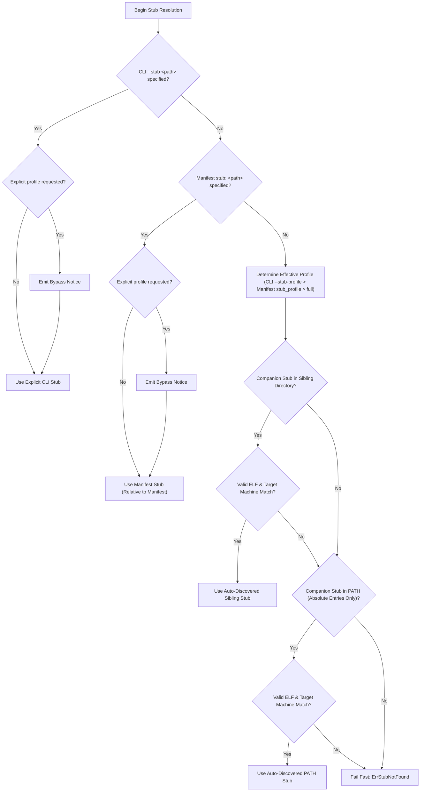

# microfat Installation Transaction, Ownership Metadata & Companion Discovery Contract

**Document Version:** 1.0.0-draft  
**Status:** Proposed design for #203 — not implemented by #40  
**Related Issues:** [#40](https://github.com/EpicBlackWolfZ/microfat/issues/40) (Stub Profile Selection — implemented), [#203](https://github.com/EpicBlackWolfZ/microfat/issues/203) (Verified Linux Release Installer — proposed design), [#204](https://github.com/EpicBlackWolfZ/microfat/issues/204) (Atomic Update Transaction — proposed design), [#205](https://github.com/EpicBlackWolfZ/microfat/issues/205) (Ownership Detection — proposed design)

---

## 1. Scope & Implementation Boundaries

The `microfat` toolchain packages microarchitecture-specialized Go ELF binaries (e.g. `amd64_v1`..`v4`, `arm64_v8.0`..`v9.5`) into self-dispatching fat executables. At packaging time, `microfat` prepends a launcher stub to the payload. To support different production requirements, `microfat` provides two companion launcher stubs:
1. **`microfat-stub` (`full`)**: The standard launcher stub featuring interactive runtime meta-commands (`--microfat:info`, `--microfat:optimize`, `--microfat:trim`, etc.), container resource auto-tuning, and direct in-memory (`memfd_create`) / cache dispatch.
2. **`microfat-stub-minimal` (`minimal`)**: A lightweight launcher stub compiled with `-tags minimal` with interactive introspection and optimization commands stripped for smallest payload overhead in resource-constrained environments.

### Implementation Boundary Clarification
- **Implemented by #40**: The profile selection mechanism (`--stub-profile`, manifest `stub_profile`), explicit `--stub` flag override precedence, companion discovery hierarchy, non-executing ELF machine validation, and sibling directory resolution across native, `memfd_create`, and disk-cache dispatches.
- **Proposed Future Design for #203, #204, #205**: The verified release downloader/installer (#203), generation directory store and single atomic pointer activation (#204), and installation ownership metadata tracking/adoption (#205). These installer capabilities are **not implemented** in the current release and represent an architecture specification for future implementation.

---

## 2. Implemented Architecture: Launcher Profile Selection & Discovery Contract (#40)

### 2.1 Sibling Companion Triad

When deployed or built in a development repository, `microfat` expects three sibling executable binaries:

```
<install-dir>/
├── microfat                 # Universal fat CLI binary (containing specialized CPU variants)
├── microfat-stub            # Standard (full) launcher stub binary
└── microfat-stub-minimal    # Lightweight (minimal) launcher stub binary
```

- **Preserved Binary Bytes Invariant**: Binaries are pre-finalized during the build process. Tools must NEVER execute `strip`, `objcopy`, `install -s`, or any ELF-rewriting tool on `microfat` or either launcher stub. Such utilities truncate the embedded payload table and 56-byte trailer (`\x00\xFA\x7FMICRO`), rendering fat binaries inoperable.
- **Explicit Stub Precedence**: An explicitly supplied `--stub <path>` flag or manifest `stub:` path is treated as caller-provided input data. It takes unconditional precedence over automatic companion discovery. When an explicit profile was also requested, `microfat` emits an operational notice:
  `Using explicit launcher stub <path>; automatic stub-profile selection was bypassed. The requested profile is not asserted for this custom path.`

### 2.2 5-Tier Precedence Hierarchy

When packaging fat binaries (`microfat pack` or `microfat pgo-pack`), `microfat` resolves the launcher stub binary according to the following strict hierarchy:



1. **Explicit CLI `--stub <path>`**:
   - Takes absolute precedence over automatic profile discovery and manifest declarations.
   - Evaluated relative to the caller's working directory.
   - Must resolve to a regular, readable file. Fails fast with `ErrStubNotFound` if missing or unreadable (no silent fallback).
   - An empty string (`--stub=""` or `--stub=`) is rejected as invalid flag usage. However, a bare argument containing whitespace (such as `--stub " "`) is treated as pathname data and looked up in the filesystem without stripping.
   - Explicit stubs are input data; they do not require executable permission bits (e.g. mode 0644 is accepted).

2. **Manifest `stub:` field**:
   - Evaluated relative to the manifest directory.
   - Overrides automatic companion discovery when CLI `--stub` is omitted.
   - Must resolve to a regular, readable file. Fails fast with `ErrStubNotFound` if missing or unreadable.
   - When an explicit profile was requested, emits the operational bypass notice.

3. **Sibling Discovery via `ResolveInstallationDirectory()`**:
   - Evaluates the directory containing the running `microfat` executable.
   - **Native Execution**: Resolved via `/proc/self/exe` (`readlink`) falling back to `os.Executable()`.
   - **Dispatched Execution (memfd / cache)**: When `microfat` runs as a dispatched fat binary, `/proc/self/exe` points to `/memfd:microfat_payload (deleted)` or `$XDG_CACHE_HOME/microfat/...`. In this mode, `ResolveInstallationDirectory()` reads `MICROFAT_ORIGINAL_EXE`, cryptographically validates the running payload's size and SHA-256 checksum against the original executable's embedded index table, and derives the true parent installation directory.
   - Looks for `microfat-stub` when profile is `full`, or `microfat-stub-minimal` when profile is `minimal`.

4. **PATH Discovery (Absolute Directories Only)**:
   - If sibling discovery does not find the target companion stub, `microfat` inspects `$PATH`.
   - **Security Boundary**: Only absolute directory entries in `$PATH` are evaluated. Empty entries, current directory (`.`), and relative paths are strictly ignored to prevent binary injection.
   - Candidate files in PATH must have executable permissions (`0111`).
   - PATH discovery alone never authenticates same-release provenance; it is a convenience fallback for package managers that split binaries into separate directories.

5. **Explanatory Failure**:
   - If no valid companion stub is located, `microfat` halts with an explicit error detailing the missing stub, the selected profile, and actionable remediation steps.

### 2.3 Non-Executing Candidate Inspection

To prevent executing untrusted, foreign, or malicious binaries during discovery:
- Candidate files are opened in read-only mode with bounded inspection.
- The ELF identification header (64 bytes) is validated for:
  - Magic bytes: `0x7F, 'E', 'L', 'F'`
  - ELF Class: `ELFCLASS64` (64-bit)
  - ELF Data Encoding: `ELFDATA2LSB` (1) or `ELFDATA2MSB` (2)
  - ELF Version: `EV_CURRENT` (1)
  - Header Size: `e_ehsize >= 64`
  - ELF Machine Type: `EM_X86_64` (0x3E) for `amd64` / `x86_64`, `EM_AARCH64` (0xB7) for `arm64` / `aarch64`.
- Candidates targeting an incompatible CPU architecture (e.g. attempting to package an `arm64` fat binary using an `amd64` host stub) are rejected during discovery without process execution.

---

## 3. Proposed Design: Immutable Generation Store & Atomic Pointer Activation (#203, #204)

### 3.1 Immutable Generation Directory Layout

To resolve the architectural contradiction between independent file links and transactional consistency, future installer work (#203, #204) proposes an **immutable generation store**. Release assets are never unpacked directly over active executables. Instead, each release is unpacked into its own immutable generation directory:

```
$DATA_DIR/
├── generations/
│   ├── gen-20260924-001/
│   │   ├── microfat                 # Verified CLI binary
│   │   ├── microfat-stub            # Verified full stub
│   │   ├── microfat-stub-minimal    # Verified minimal stub
│   │   └── generation.json          # Generation provenance and checksum metadata
│   └── gen-20260925-001/
│       ├── microfat
│       ├── microfat-stub
│       ├── microfat-stub-minimal
│       └── generation.json
├── current -> generations/gen-20260925-001   # Single atomic activation symlink
└── install-manifest.json                     # Active installation ownership metadata
```

### 3.2 Public Entrypoint Links vs. Activation Pointer

In this proposed model:
- **Generation Store**: Located at `$DATA_DIR/generations/<gen-id>/` on the same filesystem. All binaries and metadata within a generation are immutable once staged.
- **Single Activation Pointer**: `$DATA_DIR/current` is an atomic symlink pointing to the active generation directory. Switching versions is performed by creating a temporary symlink (`$DATA_DIR/current.tmp -> generations/<new-gen>`) and calling `renameat` over `$DATA_DIR/current`. This provides a true atomic switch across all three binaries simultaneously.
- **Public Entrypoints in `$BIN_DIR`**: Links in `$BIN_DIR/` (e.g. `~/.local/bin/microfat`) point either to `$DATA_DIR/current/microfat` or to the generation store via `$DATA_DIR/current`. Replacing three independent links in `$BIN_DIR` directly is **not** atomic because a process can start while only one or two links have been updated; routing through the single activation pointer `$DATA_DIR/current` guarantees tripartite consistency.

---

## 4. Proposed Transaction Invariants & Concurrency Requirements (#204, #205)

The table below defines the formal behavior that future installer and updater implementations (#203, #204) must satisfy:

| Scenario | Proposed Required Behavior |
| :--- | :--- |
| **CLI starts from generation G1; G2 activates before companion discovery** | The running CLI continues using companions from G1, or fails safely if identity cannot be established. It must never silently combine a G1 CLI with G2 stubs. Future runtime binding will resolve the generation from `/proc/self/exe`'s physical target rather than re-resolving the moving `current` pointer. |
| **G1 CLI dispatches through memfd/cache** | Generation identity is cryptographically bound to the actual source executable via `MICROFAT_ORIGINAL_EXE` verification against embedded payload checksums, not by following the moving public `current` pointer at a later time. |
| **G2 is staged but activation never happens** | G1 remains fully authoritative and active. G2 staging files are not recognized as an active installation. Interrupted or orphan staging directories must be cleaned up without affecting G1. |
| **Two installers race** | Activation decisions must be serialized via an advisory file lock on the generation store (e.g. `$DATA_DIR/.lock`). Ownership metadata cannot describe a different generation from the active pointer. |
| **Metadata or publication interruption** | Recovery during subsequent runs checks the actual coherent generation and activation pointer state. It never trusts a free-floating new metadata file over the active executable state. |
| **Old generation might still be in use** | No automatic destructive pruning of older generations without a justified liveness protocol (e.g. checking open file descriptors or conservative retention of at least N previous generations). Conservative retention is the initial policy. |
| **Ownership or running-generation validation fails** | The CLI and installer fail safely with an actionable error. They never reinterpret missing metadata or validation failure as permission to overwrite files or silently select an unrelated companion. |

---

## 5. Illustrative Ownership Metadata Specification (#205)

> [!NOTE]
> The metadata schema below is **illustrative** for future development of issue #205 and does not represent an active or enforced schema in the current release.

```json
{
  "$schema": "https://microfat.dev/schemas/install-manifest-v1.json",
  "installer_version": "0.3.0",
  "install_timestamp": "2026-09-25T18:00:00Z",
  "install_scope": "user",
  "target_os": "linux",
  "target_arch": "amd64",
  "active_generation": "gen-20260925-001",
  "release": {
    "version": "v0.3.0",
    "git_commit": "EXAMPLE_COMMIT_HASH",
    "build_date": "2026-09-25T18:00:00Z",
    "archive_name": "microfat_v0.3.0_linux_amd64.tar.gz",
    "archive_sha256": "EXAMPLE_ARCHIVE_SHA256"
  },
  "bin_dir": "/home/user/.local/bin",
  "installed_files": {
    "microfat": {
      "path": "/home/user/.local/share/microfat/generations/gen-20260925-001/microfat",
      "sha256": "EXAMPLE_FILE_SHA256",
      "size_bytes": 14285120,
      "mode_octal": "0755"
    },
    "microfat-stub": {
      "path": "/home/user/.local/share/microfat/generations/gen-20260925-001/microfat-stub",
      "sha256": "EXAMPLE_STUB_SHA256",
      "size_bytes": 2841920,
      "mode_octal": "0755"
    },
    "microfat-stub-minimal": {
      "path": "/home/user/.local/share/microfat/generations/gen-20260925-001/microfat-stub-minimal",
      "sha256": "EXAMPLE_MINSTUB_SHA256",
      "size_bytes": 1195416,
      "mode_octal": "0755"
    }
  }
}
```

### Proposed Adoption & Safety Rules (#205)
1. **Pre-existing Unmanaged File Protection**: If binaries exist in `$BIN_DIR` without a corresponding `install-manifest.json` and active generation, the installer must flag them as unmanaged and refuse to overwrite them unless `--force-adopt` is explicitly supplied.
2. **Safe Uninstallation**: Uninstallation verifies file checksums against `install-manifest.json`. Files modified by the user are preserved with a warning. User caches in `$XDG_CACHE_HOME/microfat` are never deleted during application uninstallation.
