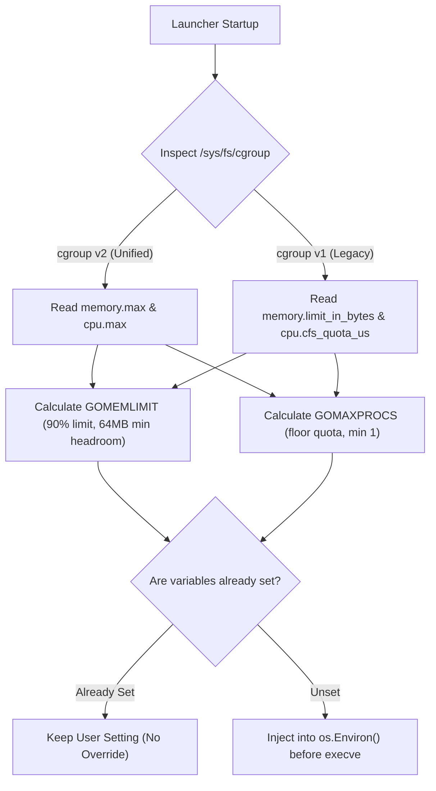

# Container Resource Auto-Tuning (`GOMEMLIMIT` & `GOMAXPROCS`)

This guide explains how Microfat automatically discovers container resource constraints from Linux cgroups and tunes Go runtime parameters before process execution.

---

## 1. The Container Performance Challenge

When running standard Go applications inside Docker or Kubernetes containers:

1. **The OOMKill Problem (`GOMEMLIMIT`)**:
   - Go's default garbage collector triggers relative to live heap size (`GOGC=100`) rather than the container's hard memory limit.
   - Under sudden spikes in allocation, the Linux kernel OOM killer terminates the container before Go reaches its GC threshold.
2. **The CPU Throttling Problem (`GOMAXPROCS`)**:
   - `runtime.NumCPU()` reports the physical or virtual core count of the entire host machine (e.g. 64 or 128 cores), even if the container is assigned a fractional quota (e.g. `2.0 CPUs`).
   - Launching 64 goroutine worker threads causes extreme Linux Completely Fair Scheduler (CFS) period exhaustion, context switching, and high p99 request latency.

---

## 2. Automatic Cgroup Inspection

Microfat uses `internal/cgroup` to inspect the container environment at startup:



---

## 3. Calculation Formulas

### A. `GOMEMLIMIT` (Memory Limit)

Given a container hard memory ceiling $M$ in bytes:

$$\text{GOMEMLIMIT} = \min(M \times \text{ratio}, M - \text{minHeadroom})$$

- **Default Ratio**: `0.90` (90% of container memory)
- **Minimum Headroom**: `64 MB` (`67,108,864` bytes reserved for thread stacks, runtime overhead, and OS file caches)
- **Small Container Fallback**: For containers $< 64\text{ MB}$, allocates 50% of total memory to prevent underflow.

### B. `GOMAXPROCS` (CPU Quota)

Given a CFS quota $Q$ and period $P$:

$$\text{CPU Quota} = \frac{Q}{P}$$
$$\text{GOMAXPROCS} = \max(1, \lfloor \text{CPU Quota} \rfloor)$$

- **Floor Rounding**: Using $\lfloor \text{Quota} \rfloor$ ensures Go does not oversubscribe CFS scheduler periods, eliminating CPU throttling latency spikes.

---

## 4. Environment Precedence & Opt-Out Controls

Microfat strictly adheres to the following precedence order:

1. **Explicit User / Kubernetes Environment Variables (Highest Priority)**:
   - If `GOMEMLIMIT` or `GOMAXPROCS` is already present in the environment (e.g. via Kubernetes deployment manifest or CLI), Microfat **never** overrides it.
2. **Custom Memory Ratio**:
   - Set `MICROFAT_MEM_RATIO=0.85` to allocate 85% of memory instead of 90%.
3. **Full Opt-Out**:
   - Set `MICROFAT_AUTOTUNE=0` or `MICROFAT_AUTOTUNE=false` to disable cgroup inspection and injection entirely.

---

## 5. Standalone Applications (`internal/cgroup`)

If you want to use the same auto-tuning logic in Go applications compiled without `microfat`, import the package directly:

```go
package main

import (
	"runtime/debug"
	"github.com/EpicBlackWolfZ/microfat/internal/cgroup"
	"go.uber.org/automaxprocs/maxprocs"
)

func init() {
	if limits, err := cgroup.ReadLimits(); err == nil {
		if memLimit, ok := cgroup.CalculateGOMEMLIMIT(limits.MemoryLimitBytes, cgroup.DefaultMemoryRatio, cgroup.DefaultMinHeadroomBytes); ok {
			debug.SetMemoryLimit(memLimit)
		}
	}
	_, _ = maxprocs.Set()
}
```
