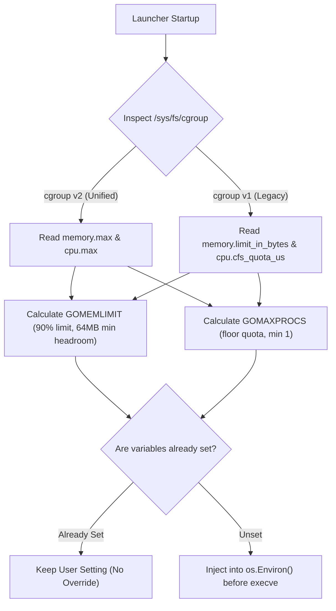
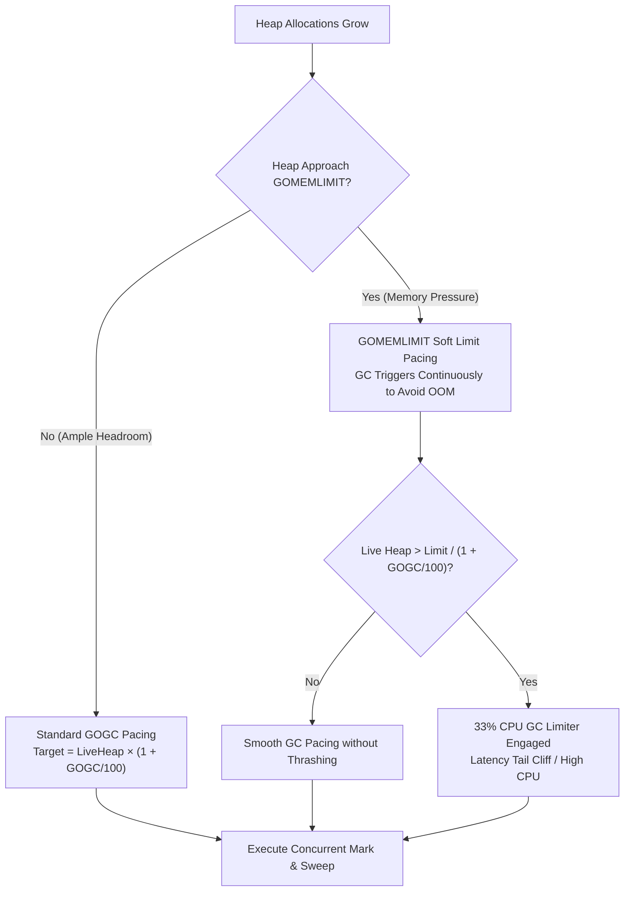

# Container Resource Auto-Tuning (`GOMEMLIMIT` & `GOMAXPROCS`)

[**← CLI Reference**](cli-reference.md) | [**Main Index**](../README.md#documentation-guide) | [**Lifecycle Modes →**](lifecycle-modes.md)

---

This guide explains how Microfat automatically discovers container resource constraints from Linux cgroups v1 and v2, configures Go runtime parameters (`GOMEMLIMIT` and `GOMAXPROCS`) before execution, and balances memory footprint against CPU utilization using workload GC profiles.

---

## 1. The Container Performance Challenge

When running standard Go applications inside Docker or Kubernetes containers:

1. **The OOMKill Problem (`GOMEMLIMIT`)**:
   - Go's default garbage collector triggers relative to live heap size (`GOGC=100`) rather than the container's hard memory limit.
   - Under sudden spikes in allocation, the Linux kernel OOM killer terminates the container before Go reaches its GC threshold.
2. **The CPU Throttling Problem (`GOMAXPROCS`)**:
   - `runtime.NumCPU()` reports the physical or virtual core count of the entire host machine (e.g. 64 or 128 cores), even if the container is assigned a fractional quota (e.g. `2.0 CPUs`).
   - Launching 64 goroutine worker threads causes extreme Linux Completely Fair Scheduler (CFS) period exhaustion, context switching, and high p99 request latency.

---

## 2. Automatic Cgroup Inspection

Microfat uses `internal/cgroup` to inspect the container environment at startup:



---

## 3. Calculation Formulas

### A. `GOMEMLIMIT` (Memory Limit)

Given a container hard memory ceiling $M$ in bytes:

$$\text{GOMEMLIMIT} = \min(M \times \text{ratio}, M - \text{minHeadroom})$$

- **Default Ratio**: `0.90` (90% of container memory limit)
- **Minimum Headroom**: `64 MB` (`67,108,864` bytes reserved for thread stacks, runtime overhead, and OS file caches)
- **Small Container Fallback**: For containers $< 64\text{ MB}$, allocates 50% of total memory to prevent integer underflow.

### B. `GOMAXPROCS` (CPU Quota)

Given a CFS quota $Q$ and period $P$:

$$\text{CPU Quota} = \frac{Q}{P}$$
$$\text{GOMAXPROCS} = \max(1, \lfloor \text{CPU Quota} \rfloor)$$

- **Floor Rounding**: Using $\lfloor \text{Quota} \rfloor$ ensures Go does not oversubscribe CFS scheduler periods, eliminating CPU throttling latency spikes.

---

## 4. Environment Precedence & Opt-Out Controls

Microfat strictly adheres to the following precedence order:

1. **Explicit User / Kubernetes Environment Variables (Highest Priority)**:
   - If `GOMEMLIMIT` or `GOMAXPROCS` is already present in the environment (e.g. via Kubernetes deployment manifest or CLI), Microfat **never** overrides it.
2. **Custom Memory Ratio**:
   - Set `MICROFAT_MEM_RATIO=0.85` to allocate 85% of memory instead of 90%.
3. **Full Opt-Out**:
   - Set `MICROFAT_AUTOTUNE=0` or `MICROFAT_AUTOTUNE=false` to disable cgroup inspection and injection entirely.

---

## 5. Garbage Collection Dynamics & `GOGC` Interaction

While `microfat` automatically calculates and configures `GOMEMLIMIT` based on container cgroups, the Go runtime garbage collector balances memory footprint against CPU utilization using **both** `GOMEMLIMIT` and `GOGC`.



### 5.1 Core Mechanics & Interaction with `GOMEMLIMIT`

1. **Standard GC Pacing (`GOGC`)**:
   Under unconstrained memory, Go initiates a garbage collection cycle whenever the live heap grows by `GOGC` percent since the end of the previous cycle:

   $$\text{Target Heap} = \text{Live Heap} \times \left(1 + \frac{\text{GOGC}}{100}\right)$$

   With the default `GOGC=100`, the GC triggers when heap allocations double the live heap size ($2\times$).

2. **Memory Limit Pacing (`GOMEMLIMIT`)**:
   When `GOMEMLIMIT` is configured, the Go runtime dynamically adjusts the next GC trigger point to ensure total memory (live heap + stacks + runtime metadata) stays below the limit. If the target heap calculated by `GOGC` exceeds `GOMEMLIMIT`, the runtime overrides `GOGC` and triggers GC earlier.

3. **The 33% CPU GC Limiter**:
   To prevent a process from entering a death spiral where 100% of CPU time is spent garbage collecting, Go caps GC CPU consumption at **33%** of total process CPU capacity (across `GOMAXPROCS` threads). When allocations continue past this point, the runtime allows heap size to temporarily exceed `GOMEMLIMIT` rather than freezing execution.

---

### 5.2 The GC Thrashing Cliff & Threshold Sizing Formula

A common failure mode in containerized microservices occurs when steady-state live heap memory approaches the configured container memory limit.

#### The Thrashing Condition
When live heap $L$ exceeds the ratio $\frac{\text{GOMEMLIMIT}}{1 + \text{GOGC}/100}$, the garbage collector cannot satisfy the proportional growth target:

$$\text{Live Heap} > \frac{\text{GOMEMLIMIT}}{1 + \frac{\text{GOGC}}{100}}$$

For example, with `GOGC=100` and $\text{GOMEMLIMIT} = 1\text{ GB}$, if the live heap is $600\text{ MB}$, the calculated target heap is $1.2\text{ GB} > 1\text{ GB}$. The runtime triggers back-to-back GC cycles, saturating the 33% CPU limiter, creating high latency spikes (p99/p999 latency cliffs) and causing severe CPU starvation.

#### Recommended `GOGC` Calculation Formula
Given a container memory ceiling $M$ (in bytes) and an expected peak live heap $L$:

$$\text{Available Headroom} = (M \times \text{ratio}) - \text{minHeadroom}$$
$$\text{Recommended GOGC} \le \min\left(100, \; \max\left(10, \; \left(\frac{\text{Available Headroom}}{L} - 1\right) \times 100\right)\right)$$

---

### 5.3 Workload Tuning Recipes & Profiles

| Workload Profile | Profile Name (`MICROFAT_GC_PROFILE`) | Default `GOGC` | Default `MEM_RATIO` | Best-Fit Workload Archetype |
| :--- | :--- | :--- | :--- | :--- |
| **Latency-Critical** | `latency_critical` | `75` | `0.90` | Strict SLA APIs, gRPC services, HTTP gateways (< 10ms p99). |
| **Memory-Constrained** | `memory_constrained` | `40` | `0.80` | Micro-containers (< 256MB/512MB RAM), sidecars, microVMs. |
| **Batch / ETL** | `batch_etl` | `off` / `200` | `0.90` | Kafka stream consumers, data pipelines, compression workloads. |
| **Adaptive** | `adaptive` | Dynamic | `0.90` | Dynamic sizing via `MICROFAT_LIVE_HEAP_ESTIMATE` (e.g. `150MB`). |
| **Default** | `default` | `100` | `0.90` | General cloud microservices and daemons. |

---

### 5.4 Kubernetes Production Deployment Manifest

```yaml
apiVersion: apps/v1
kind: Deployment
metadata:
  name: payment-service
  namespace: production
  labels:
    app.kubernetes.io/name: payment-service
spec:
  replicas: 3
  selector:
    matchLabels:
      app: payment-service
  template:
    metadata:
      labels:
        app: payment-service
    spec:
      containers:
        - name: service
          image: registry.example.com/payment-service:v1.4.0
          resources:
            requests:
              cpu: "2000m"
              memory: "1024Mi"
            limits:
              cpu: "2000m"
              memory: "1024Mi"
          env:
            # Microfat automatically discovers cgroup limits and sets:
            # GOMEMLIMIT = min(1024MB * 0.85, 1024MB - 64MB) = ~870MB
            # GOMAXPROCS = 2
            - name: MICROFAT_MEM_RATIO
              value: "0.85"
            - name: MICROFAT_GC_PROFILE
              value: "latency_critical"
            - name: MICROFAT_LOG
              value: "json"
          securityContext:
            readOnlyRootFilesystem: true
            allowPrivilegeEscalation: false
            capabilities:
              drop: ["ALL"]
```

---

## 6. Standalone Applications (`runtimeinit`)

If you want to use the same auto-tuning logic in Go applications compiled without `microfat`, import the `runtimeinit` package directly.

### Automatic Initialization via Blank Import
Simply add a blank import to your `main.go` or application entry point:

```go
package main

import (
	_ "github.com/EpicBlackWolfZ/microfat/runtimeinit"
)

func main() {
	// GOMEMLIMIT and GOMAXPROCS are already configured before main() executes!
}
```

### Programmatic Configuration & Diagnostic Inspection
Alternatively, invoke `runtimeinit.AutoTune()` programmatically to customize parameters, select workload profiles, and inspect resolved container limits:

```go
package main

import (
	"log"

	"github.com/EpicBlackWolfZ/microfat/runtimeinit"
)

func main() {
	res := runtimeinit.AutoTune(
		runtimeinit.WithProfile(runtimeinit.ProfileLatencyCritical), // GOGC=75 for strict SLA microservices
		runtimeinit.WithMemoryRatio(0.85),                          // 85% instead of default 90%
		runtimeinit.WithMinHeadroom(128*1024*1024),                  // 128MB reserved headroom
	)

	log.Printf("cgroup v%d: GOMEMLIMIT=%d applied=%t, GOMAXPROCS=%d applied=%t, GOGC=%d (profile=%s, applied=%t)",
		res.CgroupVersion, res.GOMEMLIMIT, res.MemLimitApplied, res.GOMAXPROCS, res.MaxProcsApplied,
		res.GOGC, res.ProfileApplied, res.GOGCApplied)
}
```

### Adaptive Dynamic Tuning (`ProfileAdaptive`)
For dynamic `GOGC` tuning based on steady-state live heap sizing:

```go
package main

import (
	"github.com/EpicBlackWolfZ/microfat/runtimeinit"
)

func main() {
	runtimeinit.AutoTune(
		runtimeinit.WithProfile(runtimeinit.ProfileAdaptive),
		runtimeinit.WithLiveHeapEstimateString("150MB"), // Dynamic formula sizing
	)
}
```

---

## 7. Diagnostics, Telemetry & Observability

### Downstream Environment Variables Exported

Whenever the launcher stub executes a payload variant, it exports runtime metadata to child processes in `os.Environ()`:

| Environment Variable | Description | Example |
| :--- | :--- | :--- |
| `MICROFAT_SELECTED_VARIANT` | Microarchitecture level selected for execution | `v3` |
| `MICROFAT_HOST_ARCH` | Detected host CPU architecture | `amd64` |
| `MICROFAT_HOST_LEVEL` | Highest detected microarchitecture capability of host | `v4` |
| `MICROFAT_EXEC_MODE` | Runtime dispatch mechanism (`memfd` or `cache`) | `memfd` |
| `MICROFAT_DISPATCH_MODE` | Alias for `MICROFAT_EXEC_MODE` | `memfd` |
| `MICROFAT_POLICY_APPLIED` | Dispatch policy applied | `safe_avx512` |
| `MICROFAT_OVERRIDE_REASON` | Explanatory reason or rule triggering the policy | `Intel Skylake-X downclock protection` |
| `MICROFAT_SELECTED_SHA256` | SHA-256 hash of the uncompressed payload | `fda5c10d86f6...` |
| `MICROFAT_SELECTED_SIZE` | Uncompressed byte length of selected payload | `7389447` |
| `MICROFAT_CGROUP_VERSION` | Detected cgroup version (`1` or `2`) | `2` |
| `MICROFAT_CGROUP_LIMIT_BYTES` | Raw container memory limit in bytes | `2147483648` |
| `MICROFAT_CGROUP_CPUS` | Raw container CPU CFS quota | `4.00` |
| `MICROFAT_CGROUP_GOMEMLIMIT` | Computed `GOMEMLIMIT` ceiling | `1932735283B` |
| `MICROFAT_CGROUP_GOMAXPROCS` | Computed `GOMAXPROCS` core count | `4` |
| `MICROFAT_CGROUP_GOGC` | Computed `GOGC` pacing target | `75` |
| `MICROFAT_CGROUP_GC_PROFILE` | Active GC workload profile name | `latency_critical` |

### Structured Telemetry Logging (`MICROFAT_LOG=json`)

Set `MICROFAT_LOG=json` in your container environment to emit structured JSON telemetry to `stderr` upon payload dispatch:

```json
[microfat] {
  "event": "dispatch",
  "timestamp_unix_nano": 1787730797569802157,
  "host_arch": "amd64",
  "host_level": "v4",
  "selected_variant": "v3",
  "selected_sha256": "76dafaf71f0deb2febd21157b698b920b77ce5a023879183b2bec5915cf64dd4",
  "selected_size_bytes": 4100359,
  "exec_mode": "memfd",
  "policy_applied": "avx512_downclock_protection",
  "policy_reason": "Intel Skylake-X/Cascade Lake AVX-512 downclocking protection applied (capped at v3)",
  "cgroup_version": 2,
  "cgroup_mem_limit_bytes": 1073741824,
  "cgroup_cpu_quota": 4,
  "gomemlimit": "966367641B",
  "gomaxprocs": "4",
  "decompression_duration_us": 4955,
  "total_launcher_us": 5681
}
```

### Prometheus / Grafana Alerting Rules

```promql
# Alert: Go service is approaching GC thrashing under container memory limits
sum(rate(go_gc_limiter_last_limit_reached_time_seconds[5m])) by (pod) > 0

# Alert: Container memory utilization exceeds 85% of cgroup limit
container_memory_working_set_bytes{container="service"}
  / container_spec_memory_limit_bytes{container="service"} > 0.85
```

---

[**← CLI Reference**](cli-reference.md) | [**Main Index**](../README.md#documentation-guide) | [**Lifecycle Modes →**](lifecycle-modes.md)
