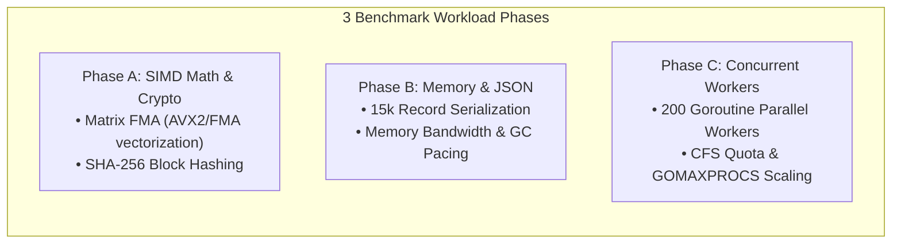

# Microfat Demonstration & Benchmark Suite

This directory contains a complete, self-contained demonstration project showing the real-world performance impact of **CPU microarchitecture specialization (`v1` vs `v3` vs `v4`)**, **binary lifecycle modes (Universal Fat vs Trimmed Fat vs Native ELF)**, and **runtime container resource tuning (`GOMEMLIMIT` & `GOMAXPROCS`)**.

---

## 1. What the Demo Tests

The application executes three distinct compute and memory workloads:



1. **Phase A: SIMD Vector Math & Cryptography (`demo math`)**:
   - Floating-point matrix multiply-accumulate operations leveraging hardware **Fused Multiply-Add (`FMA`)** and **`AVX2`** vector units.
   - Cryptographic hashing via SHA-256 on memory blocks.
2. **Phase B: Bulk Memory & JSON Processing (`demo json-mem`)**:
   - Serialization and deserialization of 15,000 structured records with timestamps, tokens, and numerical score vectors.
   - Stresses heap allocation, garbage collector pacing (`GOMEMLIMIT`), and memory throughput.
3. **Phase C: High-Concurrency Worker Scaling (`demo concurrent`)**:
   - Multi-goroutine parallel worker pool executing arithmetic tasks across all available CPU threads, validating `GOMAXPROCS` container CFS scheduler auto-tuning.

---

## 2. Quick Start

### Build & Run the Universal Fat Binary
```bash
# Build v1, v3, v4 variants and package the universal fat binary:
make fat

# Run all 3 workloads:
make run
```

### Try the Trimmed Fat Binary Mode
```bash
# Trim the binary in-place to your host architecture (-45% disk size):
make trim

# Inspect the single-variant fat binary:
bin/demo-trimmed --microfat:info

# Run workloads in anonymous RAM with container auto-tuning:
bin/demo-trimmed all
```

### Materialize Raw Native ELF
```bash
# Permanently extract raw uncompressed native v3 ELF:
make optimize

# Run the native binary directly with zero launch overhead:
bin/demo-optimized all
```

---

## 3. Running the Full 100-Iteration Benchmark Suite

To measure and compare all 5 configurations across 100 iterations:

```bash
make bench
```

### Benchmark Metrics Measured:
1. **Startup Overhead (`--help`)**: Isolates kernel execve, launcher stub decompression, and runtime initialization.
2. **Pure In-Process Compute Time (`ops/sec` and `ms`)**: Measures pure steady-state hardware throughput inside the application after startup is complete.
3. **Total Wall-Clock Latency**: Startup + computation combined.
4. **Binary Footprint on Disk**: Exact file size across all packaging formats.

---

## 4. Understanding the Results: Startup vs Steady-State Compute

When evaluating fat binaries vs native binaries, it is important to distinguish between **One-Time Startup Overhead** and **Steady-State Compute Speed**:

| Characteristic | Native ELF (`v3`) | Universal FAT | Trimmed FAT (`--microfat:trim`) |
| :--- | :--- | :--- | :--- |
| **Startup Overhead** | `~1.5 ms` | `~11.5 ms` (+10ms decompression) | `~11.5 ms` (+10ms decompression) |
| **Steady-State Compute** | **100% Native Hardware Speed** | **100% Native Hardware Speed** | **100% Native Hardware Speed** |
| **Container Auto-Tuning** | Manual configuration | ✅ Automatic `GOMEMLIMIT` & `GOMAXPROCS` | ✅ Automatic `GOMEMLIMIT` & `GOMAXPROCS` |
| **Hardware Portability** | Runs on `v3` only | Runs on **any** x86-64 CPU (`v1`–`v4`) | Runs on `v3` only |

> [!NOTE]
> The **10ms decompression overhead** occurs **only once at process launch** when streaming the payload into anonymous RAM (`memfd_create`). Once running, CPU vector instructions execute at full native hardware speed. For persistent microservices and servers, this 10ms is completely negligible. For ultra-fast sub-2ms CLI utilities, use `--microfat:optimize` to eliminate the startup overhead entirely.
